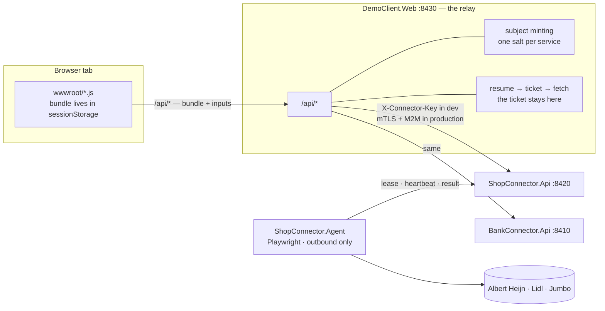
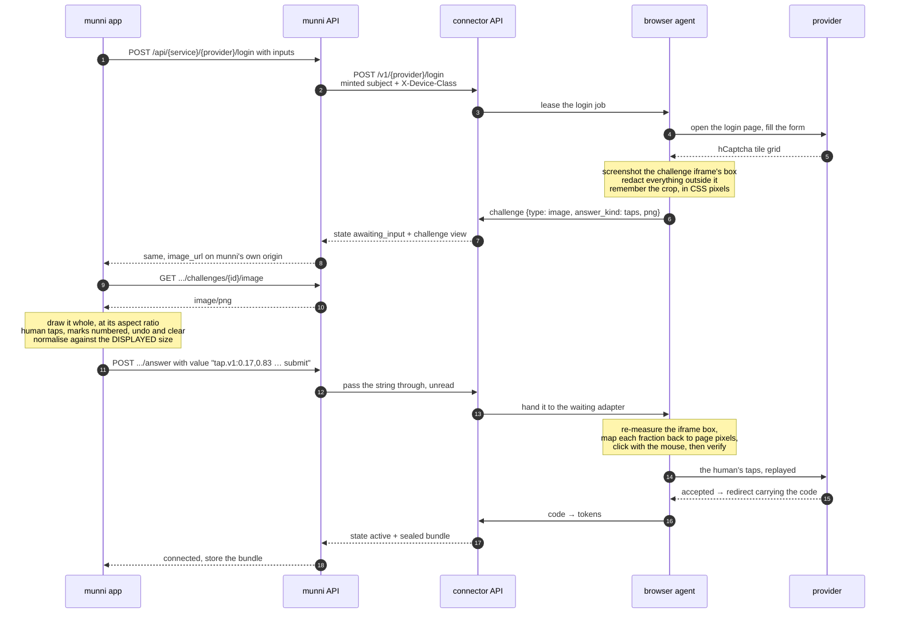

# demo-client — the reference consumer

A browser app and a relay that connect real accounts through the two
connectors and show what comes back. It exists for two reasons, and the
second one is the important one:

1. It is how you **see the platform work** — a manifest-driven login form,
   a CAPTCHA relayed to a human, live progress over SSE, receipts and
   transactions landing in a table.
2. **`src/DemoClient.Web/Relay/` is the reference implementation of what
   munni's server has to build.** Everything in
   [`docs/munni-integration-plan.md`](../docs/munni-integration-plan.md) §2 —
   subject minting, bundle pass-through, hiding the ticket, owning the copy,
   declaring the device class — is running code here, in about a thousand
   lines. If munni's relay disagrees with this one, one of them is wrong.

The front end is plain HTML, CSS and ES modules served from `wwwroot`.
No npm, no bundler, no build step: `dotnet run` is the whole toolchain.

---

## Topology



The browser never talks to a connector, never holds a connector credential,
never learns a connector hostname, and never sees a ticket. Everything it
knows arrives through `/api/*`.

There is deliberately no arrow from `ShopConnector.Api` to a real provider,
because a browser-tier one is never reached from there. **The catalogue is
split in two, and which half a provider is in is the single fact that decides
whether it needs an agent:**

| Tier | Providers | Where a job runs |
| --- | --- | --- |
| `http` | Lidl Plus, Picnic, WooCommerce guest, Magento guest, the `mock-store-*` fixtures | inline, in the control plane |
| `browser_*` | Albert Heijn, Amazon.nl, bol.com, Coolblue, Jumbo, `mock-store-persistent` | leased to an agent |

The inline runner serves exactly the providers whose manifest says
`agent.class: inline, required: false`. That is not the mock fleet alone any
more — four real providers sit there, which is why `--no-agent` is a real way
to demo the platform and not just a way to demo the fixtures.

---

## Quick start

```powershell
.\run-demo.ps1              # Windows
```

```sh
./run-demo.sh               # macOS / Linux
```

Then open **<http://localhost:8430>**.

The script starts four processes in the order they depend on each other,
waiting for each connector's `/v1/health` before starting the next:

| | |
| --- | --- |
| `ShopConnector.Api` | <http://localhost:8420> |
| `BankConnector.Api` | <http://localhost:8410> |
| `ShopConnector.Agent` | no port — every call it makes is outbound |
| `DemoClient.Web` | <http://localhost:8430> |

Ctrl-C stops all of them, youngest first.

```
--no-agent      skip the shopping agent. The browser-tier providers — Albert
                Heijn, Amazon.nl, bol.com, Coolblue and Jumbo — then report
                agent_unavailable, which is the error the UI is supposed to
                render. The http-tier ones are unaffected and still connect:
                Lidl Plus, Picnic, both guest-order providers, and every mock-*
                except mock-store-persistent.
--bank-agent    also start BankConnector.Agent, which is what the browser-tier
                bank mocks need. It needs no browser binaries — they are mocks.
--no-build      start what is already in bin/.
```

`DEMO_SHOP_PORT`, `DEMO_BANK_PORT` and `DEMO_PORT` move the ports if
something already owns them. `DEMO_USER_ID` changes the one demo user, which
changes both minted subjects.

Nothing else is needed: the connectors run on Sqlite in their own project
directories and mint their bundle keys in memory at startup.

---

## What you can connect

| Provider | Service | Agent | What it is good for |
| --- | --- | --- | --- |
| `mock-store-simple` | shop | none | the smoke test |
| `mock-store-sms` | shop | none | an `mfa_code` challenge (`123456`) |
| `mock-store-captcha` | shop | none | an `image` challenge with real PNG bytes (`MOCK1`) — a **text** answer, the other half of [Pictures the human taps](#pictures-the-human-taps) |
| `mock-store-slow` | shop | none | live progress and SSE — seven steps, slowly |
| `mock-store-broken` | shop | none | `provider_changed`, the alert path |
| `mock-bank-simple` | bank | none | accounts + transactions, balances that reconcile |
| `mock-bank-broken` | bank | none | `provider_changed` from the bank side |
| **Albert Heijn** (`ah`) | shop | **required** | a username and password typed into `login.ah.nl` by a headless browser — see the sign-in flow below |
| **Amazon.nl** (`amazon-nl`) | shop | **required** | `browser_interactive`, `unattended_fetch: false` — the provider that most wants a human at the browser |
| **bol.com** (`bol`) | shop | **required** | `browser_once`, `unattended_fetch: false` |
| **Coolblue** (`coolblue`) | shop | **required** | `browser_once`, and the only real provider whose egress requirement is `any` rather than `residential` |
| **Jumbo** (`jumbo`) | shop | **required** | a ~24h session the UI has to explain without sounding broken |
| **Lidl Plus** (`lidl`) | shop | none | `http` tier, `oauth_redirect`. **It stopped needing an agent** — older notes here said otherwise |
| **Picnic** (`picnic`) | shop | none | `http` tier and genuinely unattended: no browser, no human, a token that renews by being used |
| **WooCommerce guest** (`woo-guest`) | shop | none | one unauthenticated GET against a shop's own order page |
| **Magento guest** (`magento-guest`) | shop | none | the same idea, and the cheapest provider in the service to operate |
| `mock-bank-sca` | bank | `--bank-agent` | `code_display` then `app_approval` — two challenges in a row |
| `mock-bank-slow` | bank | `--bank-agent` | the one provider with `web_support: none` — the connector **refuses** it to a web client, so the demo cannot connect it at all. That refusal is the thing worth seeing |
| `mock-store-persistent`, `mock-bank-persistent` | either | **BYO** | `secret_custody: agent`; `run-demo` starts a *pooled* agent, so these report `agent_unavailable` |

**Some provider facts are still unconfirmed**, and they are marked as such in
the adapters rather than guessed — so a real account can get further than the
demo does:

- **Lidl's client secret** is empty by default; the token call sends
  `LidlPlusNativeClient:`.
- **Jumbo's GraphQL operation document** is a placeholder. Login can succeed
  and the receipts fetch will then fail `provider_changed` until a live
  capture settles it.

**Albert Heijn's `ClientId` is no longer one of them: it is `appie-ios`,**
read out of `gwillem/appie-go` v0.0.12 on 2026-07-27. The earlier default of
`appie` is what broke the first live login attempt, and it did not present as
a client-id problem — a wrong client id fails the *token exchange*, so it
surfaces as `session_expired` or `invalid_credentials` right after a sign-in
that visibly succeeded. If AH ever bumps it, the override is still
`ShopAdapters__Ah__ClientId` on **both** the API and the agent.

[`shop-connector/src/ShopConnector.Adapters/README.md`](../shop-connector/src/ShopConnector.Adapters/README.md)
lists every unconfirmed value and which configuration key corrects it.

---

## credentials.local.jsonc

> **It holds real passwords in plaintext.** It is git-ignored, it is for
> local testing on your own machine, and it is read by exactly one endpoint —
> `GET /api/prefill/{service}/{provider}`, which exists only in Development
> and answers 404 anywhere else. Do not copy it to a server, into a
> container, into a ticket or into a screenshot. Delete it when you are done.

```sh
cp credentials.example.jsonc credentials.local.jsonc
```

The extension is `.jsonc` because the file is mostly comments and editors
were flagging them as syntax errors. The reader has always skipped comments
and trailing commas; only the name changed. Both `.gitignore`s match
`credentials.local.*` by prefix, so a future extension change cannot silently
un-ignore a file full of real passwords.

Then fill in the providers you actually intend to test and delete the rest.
The example carries an entry for every provider in both connectors, with the
exact keys that provider's manifest declares and a `_comment` saying what the
flow is and where each value comes from.

```jsonc
{ "<service>": { "<provider>": { "config": { … }, "inputs": { … } } } }
```

`config` and `inputs` are the two halves of `POST /login`: `config` is the
non-secret settings a provider needs on every call (Lidl's `country` and
`language`), `inputs` is the credential step. Both are keyed exactly as the
manifest declares them — `curl http://localhost:8420/v1/providers` prints the
same document the connect form is rendered from.

The file may live beside this README or beside `DemoClient.Web`; the relay
looks from its content root upwards. Comments and `_comment` fields are
ignored by the reader.

### The Albert Heijn sign-in flow

**This changed, and older notes describing a paste step are wrong.** AH used
to raise a `redirect` challenge: you opened AH's authorize URL yourself, hit
an `appie://login-exit` link your browser could not follow, and pasted that
dead URL back into the demo. It was clever and it was unusable — an
`appie://` redirect on a phone either opens the real Appie app or fails with
nothing to copy, and there is no address bar to copy from.

So AH is now an ordinary password provider, and it looks like every other
one:

1. Fill in `username` and `password` — the same ones you use in the Appie app
   — and press connect. `credentials.local.jsonc` prefills them like any
   other provider's.
2. The connector leases the job to **ShopConnector.Agent**, which opens
   `login.ah.nl` in a headless browser and signs in with what you typed.
3. AH finishes by redirecting to `appie://login-exit?code=…`. The agent
   intercepts that redirect and lifts the `code` out of it. Nobody sees it
   and nobody pastes anything.
4. The code is exchanged at `POST /mobile-auth/v1/auth/token` for an access
   and a refresh token, the refresh token is sealed into your bundle, and the
   session becomes `active`.

After that **no browser ever runs for AH again**: the refresh token serves
every receipts fetch headlessly, which is what `browser_once` means and what
AH and Lidl have in common.

Two consequences worth stating plainly:

- **AH now requires the agent.** Not just for login — the inline runner only
  accepts providers declaring `agent.class: inline, required: false`, so with
  `--no-agent` an AH *fetch* fails with `agent_unavailable` too. AH used to
  be the one real provider that needed no agent at all. It is not any more.
- **The connector now handles your AH password.** It is used to fill a login
  form and is never sealed into the bundle — only the refresh token is — but
  the old claim that AH is the provider we never see a password for no longer
  holds, and the credentials file now has real secrets in its `ah` entry.

AH may still present an **hCaptcha** on a login it does not like. `login.ah.nl`
carries it as two iframes — `…/hcaptcha.html#frame=checkbox-i` for the "I am
human" box and `…/hcaptcha.html#frame=challenge` for the image grid. A grid
cannot be answered by typing, which is what used to make it unrelayable. It
*can* be answered by tapping, and that is what
[Pictures the human taps](#pictures-the-human-taps) below is for: we carry the
picture out and the taps back, and the person who owns the account is the one
who solves it. We do not solve it, we never will, and no solving service is
ever called.

Until the AH adapter raises that kind of challenge, what ships today still
depends on who can reach the browser:

- **Attended** — a headed agent on hardware you are sitting at. You get an
  `app_approval` challenge saying to solve the captcha in the window the agent
  opened. There is nothing to type back; solving it is what lets AH continue,
  and the redirect it then sends is what finishes the login. You need not
  click anything in this UI at all.
- **Unattended** — a pooled, headless agent. Nobody can reach that browser, so
  the login fails at once with `blocked_by_provider` rather than waiting out a
  question no one will ever see. Connect AH from a machine you are at.

A plain image CAPTCHA — a picture with a box beside it — is relayed as an
`image` challenge with `answer_kind: "text"`, exactly like
`mock-store-captcha`. None of them is ever solved automatically: solving a
provider's CAPTCHA for it is abuse, and relaying it to the human who owns the
account is not.

---

## Pictures the human taps

Some providers ask a question that cannot be typed. An hCaptcha image grid —
nine tiles, *"click each image containing a bus"* — has no characters to read
out, so relaying it as a picture with a text box beside it produces an answer
no page can accept. It **can** be answered with taps: we screenshot the
challenge, the picture travels to the person who owns the account, they touch
the tiles in their own app, and the points travel back for the agent to click.

That is the whole of it. **We never solve a captcha, never call a solving
service, and never spoof a fingerprint.** The human solves it; we carry the
picture one way and the taps the other.

`wwwroot/challenges.js` (`tapChallenge`) is the reference rendering. This
section is written so the same thing can be built on iOS or Android without
reading any of it.

> **State of it, so nobody demos a promise.** The contract
> (`ChallengeAnswerKind`, `Tap`, `TapAnswer`) and this client are in. What is
> not yet end to end: no adapter raises `answer_kind: "taps"` today, and the
> connector's own `ChallengeView` does not carry the field yet — until it
> does, every challenge reaches a client as `"text"` and this renderer never
> runs. Both are being landed alongside this, and the contract below does not
> change when they do.

### It rides the endpoints you already have

There is **no new endpoint, no new content type and no new response shape.** A
tap challenge is an ordinary challenge with one extra field, and its answer is
an ordinary answer with a string in it.

**1. The challenge arrives** in the session view — over SSE
(`GET …/login/{session}/events`, `event: state`) or from a poll of
`GET …/login/{session}` — as `state: "awaiting_input"` with:

```json
{
  "id": "chl_7f1c…",
  "type": "image",
  "answer_kind": "taps",
  "prompt_key": "connect.challenge.captcha_tiles",
  "image_url": "/v1/ah/login/ses_…/challenges/chl_7f1c…/image",
  "expires_at": "2026-07-28T14:31:07Z"
}
```

(`prompt_key` is whatever key the adapter chose; your copy table owns the
English, as it does for every other key. An unmapped one must degrade to
something honest, never to a raw identifier.)

`answer_kind` is the only new thing, and it — not `type` — decides what you
render. `type: "image"` is a picture with a text box at one provider and a
grid of tiles at the next; the type cannot tell those apart, which is exactly
why the field exists. Switch on `answer_kind` first, then fall back to `type`.
A payload **without** the field means `"text"`, so every challenge that
already works keeps working.

**2. Fetch the picture** from your own origin. `image_url` is relative to the
*connector*, which the app can neither see nor authenticate against, so munni
mirrors the path under its own API exactly as this demo does:

```
GET /api/{service}/{provider}/login/{session}/challenges/{challenge}/image
→ 200 image/png
```

It is authenticated, one-shot and alive only while the challenge is. Fetch the
bytes and hold them; do not put a bare URL in an ``/`UIImageView` that
cannot carry your session — a failure here has to be something you can render,
not a broken-image glyph.

**3. Post the answer** to the endpoint every other challenge already uses:

```
POST /api/{service}/{provider}/login/{session}/answer
{ "challenge_id": "chl_7f1c…", "value": "tap.v1:0.1667,0.8333;0.5,0.5;submit" }
```

Mid-fetch challenges are identical, on `POST …/jobs/{job}/answer`. `value` is
a string for every answer kind — an SMS code, a pasted URL, or this — so
nothing about your networking layer changes.

### The one thing that goes wrong silently

**Taps are fractions of the displayed picture, never pixels.**

```
x = (touch.x - imageFrame.minX) / imageFrame.width      // 0 = left edge, 1 = right
y = (touch.y - imageFrame.minY) / imageFrame.height     // 0 = top,  1 = bottom
```

Nobody agrees on the size of that picture. The agent captured it at the
browser's device scale factor, so the PNG may be 2× the page's own pixels; the
relay passes the bytes through untouched; and your app draws it at whatever a
360pt column allows. A pixel coordinate measured on your copy therefore lands
in a different tile once the agent maps it back. A fraction lands in the same
tile whatever either end did to the bitmap.

The failure is quiet, and it is quiet on exactly the devices that matter: the
marks appear under the finger, the answer posts, the agent clicks — and the
login fails on a phone while being perfectly right on the tablet it was
demoed on. Three ways to get it wrong, all of them invisible locally:

- **Measuring against the wrong rectangle.** Use the frame the image is
  *drawn* in, not the container's. `contentMode = .scaleAspectFit` /
  `ContentScale.Fit` letterboxes the picture, and the bars are part of the
  view but not part of the image. The web version measures against the
  `` element's own client rectangle for exactly this reason — an image
  has no border and no padding, so that rectangle cannot be anything but the
  picture.
- **Using the PNG's own pixel size.** Never divide by `image.width`. Divide by
  the size on screen. The two differ by the device scale factor at both ends
  and the ratio is not a constant you can bake in.
- **Cropping or letterboxing the picture yourself.** `scaleAspectFill` crops,
  and a tap in the visible part of a cropped image is not a fraction of the
  image. Show the whole thing, at its natural aspect ratio, scaled to fit.

Clamp to `0…1` before sending. A press on the last row of pixels can round a
hair over 1, and a coordinate outside the range is refused by the parser at
the other end — throwing away the whole answer for a rounding error.

### The answer's grammar

```
tap.v1:<x>,<y>;<x>,<y>;submit
```

- `tap.v1:` — a fixed prefix, so a tap answer is unmistakable inside a field
  that also carries SMS codes and redirect URLs, and versioned so a second
  grammar can be added later without guessing which one a string is.
- Coordinates are decimals in `0…1`, **four decimal places**, **always a
  full stop**. Format them in the invariant locale — half of Europe writes
  `0,5`, and `0,5` here parses as two coordinates. Round to four places
  yourself: that is all the wire keeps, and a client that sends seventeen
  digits is agreeing with the agent about numbers that are not the same.
- **The list is ordered**, and the order is the order the human tapped. Some
  grids ask for tiles in sequence; that is information your app has and cannot
  be recovered once dropped.
- **`submit` is a terminal marker**, last, and it means "the human is done —
  press the widget's verify control after replaying these taps". Anything
  after it is rejected outright rather than half-obeyed.

Three strings worth understanding, because they are three different sentences:

| `value` | Means |
| --- | --- |
| `""` | nobody answered |
| `tap.v1:` | an answer carrying no taps, not finished |
| `tap.v1:submit` | **verify with nothing selected** — the legal way to answer a grid where nothing matches |

That last one is why `submit` lives inside the answer instead of being a
second round trip: a bare list of points cannot express it. (The other reason
is latency — a second round doubles the relay time per grid while the
captcha's token ages.) A client that wants to stream taps as they are made
sends them with no marker and sends again later; this demo sends once, on the
button.

### What the UI owes the person

- **Show the whole picture**, natural aspect ratio, scaled to fit. Do not crop.
- **Mark every tap, visibly and numbered**, in tap order. They are choosing
  tiles from a grid they cannot see us click; an unacknowledged tap gets
  tapped again.
- **Undo and clear.** A mis-tap must cost one press, not the whole login. This
  is not polish: without it the only correction available is to restart a
  sign-in that has already got as far as a captcha.
- **Position the marks in per cent of the image**, not in pixels, so rotating
  the phone moves each mark with the feature it was put on.
- **Count the challenge down.** `expires_at` is mandatory on every challenge
  because it holds a live browser hostage on an agent; when it passes, disable
  the picture and the buttons and say so. A form still accepting taps for a
  question that timed out two minutes ago is lying.
- **Keep submit enabled with nothing selected** — see the table above.
- **Do not upscale.** The web version caps at the PNG's natural size; blowing
  a small capture up buys tap accuracy at the cost of the detail the human
  needs to answer correctly.

### Degrading, if you ignore all of this

A client that never learned about `answer_kind` draws a text box over the
picture, the human types something, and the connector's `TapAnswer.TryParse`
refuses it — so the adapter reports a challenge nobody answered and the login
fails cleanly. **Nothing gets clicked.** That is deliberate: inferring taps
from whatever string came back would click a live page at coordinates no human
chose.

### The whole sequence



### What munni's server must do — and must not

**Must:** carry `answer_kind` through. This demo's relay is a byte-for-byte
pass-through, so it gets this for free; a server that maps the connector's
challenge onto its own DTO field by field will silently drop the field, and
then *every* challenge reaches the app as `text` and every tap grid renders as
a text box. It is one line, and it is the whole feature.

**Must not:** parse, validate, reformat or round the `value` string. It is the
adapter's vocabulary, not the relay's. Re-serialising `0.3333` as `0.33` moves
the tap into the next tile; "helpfully" sorting the list destroys the order
the human tapped in.

The picture is equally untouched: the agent already redacted everything
outside the challenge's own crop before the bytes left the machine, and
re-encoding, resizing or recompressing it in the middle only risks changing
the rectangle the taps were normalised against.

---

## The provider's own page, streamed

Some providers cannot be signed into with a form at all, and for the ones that
can, the form is where the password enters the platform. A `live_view`
challenge replaces it: the provider's own login page renders in the agent's
Chromium, is photographed several times a second, and is streamed to the phone
of the person who owns the account. They type their username, password and any
SMS code straight into it.

**The credential stops entering the platform.** A provider served this way
declares no auth fields, so nothing is collected by a form of ours, nothing is
written to `JobRow.InputsJson`, and nothing is handed to an agent as
`LeasedJob.Inputs`. It is not encrypted better; it is not there. Read
[`docs/streamed-login-design.md`](../docs/streamed-login-design.md) for the
custody argument in full, including the three ways it is a win and the one way
it is a regression.

`wwwroot/live-view.js` is the reference rendering. This section is written so
the same thing can be built on iOS or Android without reading any of it.

> **State of it, so nobody demos a promise.** The contract (`ChallengeType.LiveView`,
> `LiveInput`, `LiveInputBatch`, `LiveFrame`) and this renderer are in.
> **This demo's relay does not yet proxy the two live routes**, so the renderer
> draws its error block rather than a picture until it does — which is the
> correct behaviour and is not the same thing as working. No adapter raises a
> `live_view` challenge yet either.

### The two routes, and nothing else

A live view is an ordinary challenge that arrives in the ordinary place — over
SSE (`GET …/login/{session}/events`, `event: state`) or from a poll of
`GET …/login/{session}` — as `state: "awaiting_input"` with `type: "live_view"`.
It adds **two** endpoints, both derived from ids the app already holds, exactly
as the still relay's `image` route is. No payload gains a hostname.

```
GET  /api/{service}/{provider}/login/{session}/challenges/{challenge}/live/frame?after=<seq>
→ 200 image/jpeg  +  X-Live-Sequence: <long>  +  X-Live-Size: <width>x<height>
→ 204            nothing newer arrived before the poll window closed
```

It is a **long poll**, not a timer. Ask again the instant it answers, whichever
answer it gave, passing the sequence you were last given as `after`. **Omit
`after` entirely on the first request** — absent means "I have seen nothing",
and it is not the same as `after=0`.

```
POST /api/{service}/{provider}/login/{session}/challenges/{challenge}/live/input
{ "events": [ { "kind": "down", "x": 0.5, "y": 0.42, "sequence": 7 }, … ] }
→ 202 accepted    → 400 the batch is not answerable, and none of it was applied
```

Accepted is not applied. Whether the page did anything with it is the next
frame's business.

### The grammar

`kind` is one of six and there are no others:

| `kind` | Carries | Means |
| --- | --- | --- |
| `move` | `x`, `y` | the pointer moved — hovers and drags |
| `down` / `up` | `x`, `y` | the primary button. **There is no secondary button** |
| `scroll` | `x`, `y`, `delta_y` | travel, in fractions of the view |
| `text` | `text` | printable characters, typed wherever the page has focus |
| `key` | `key` | one of `backspace delete enter tab escape arrow_up arrow_down arrow_left arrow_right home end` |

Every event carries a `sequence`: your own counter, so the far end can drop a
duplicate and order what arrives out of order. A phone connection will do both.

**What is missing is the point.** Nothing in this grammar carries a URL, a
selector, a script or a file path, so navigation, evaluation and upload are not
rejected — they are unsayable. There are **no modifiers**: no Ctrl, no Alt, no
Meta, on keys or on clicks. Playwright reads `"Control+o"` as a chord and a
latched modifier turns the next click into "open in a new tab", so a chord must
be **refused whole** rather than relayed as its base key — sending plain `enter`
for Ctrl+Enter is a different keystroke than the human made.

Two bounds the server enforces, which you must enforce first:

- **`text` is at most 256 characters and may contain no control character**
  (C0 and C1: `U+0000`–`U+001F`, `U+007F`–`U+009F`). One bad character makes the
  server refuse the **whole batch**, so the human loses everything they typed
  with it. Split a long paste; split *around* the newlines rather than turning
  them into `enter`, because Enter submits a form and a trailing newline on the
  clipboard is not consent to submit. Do not cut a chunk through a surrogate
  pair — half an emoji is not a character any page can receive.
- **At most 64 events per batch.** Batch rather than sending one request per
  event: a drag is thirty moves.

### The same coordinate rule as the taps, for the same reason

**Fractions of the picture as drawn, never pixels**, measured against the frame
the image is *drawn* in:

```
x = (touch.x - imageFrame.minX) / imageFrame.width
y = (touch.y - imageFrame.minY) / imageFrame.height
```

`X-Live-Size` tells you what the agent captured. **Never divide by it.** The
whole of [The one thing that goes wrong silently](#the-one-thing-that-goes-wrong-silently)
above applies here word for word, and it is worse here: a mis-normalised tap on
a captcha grid picks the wrong tile, while a mis-normalised tap on a login page
puts the human's password into whichever box the agent's pointer happened to
land in.

Clamp to `0…1` before sending. A coordinate outside the range makes the server
refuse the batch, and the only events that can land outside are the tail of a
drag that started inside.

### The keyboard, which is the whole feature

A phone raises its keyboard in response to **a focused editable element**, and
there is no API that asks for one directly. So:

1. Put a real, focusable, invisible input over the picture. Not `display:none`,
   not `visibility:hidden`, not `hidden` — none of those can hold focus. In this
   client it is a 1px `opacity:0` field; keep it inside the viewport, because
   iOS will not raise the keyboard for a field parked offscreen, and give it a
   16px font so iOS does not zoom the page when it focuses.
2. On pointer-down over the picture, **`preventDefault()` and then `focus()`**.
   Both halves matter and they fight each other: without `preventDefault` the
   browser's own focus handling moves focus to the body and closes the keyboard
   the human just raised, and `focus()` must happen inside a user gesture or iOS
   ignores it. Offer a visible "Show keyboard" button as well — a press on a
   real button is the one gesture every mobile browser accepts a `focus()` from.
3. **Never read the field's value.** Read the delta from `beforeinput`
   (`event.data`, and `inputType` for `deleteContentBackward` and friends),
   handle `paste` yourself from the clipboard, and **empty the field on every
   `input` event, without exception** — including for an inputType you did not
   recognise. The field being empty matters more than the keystroke being
   delivered. That is the entire defence against the client accumulating what
   the server refuses to store.
4. Ignore `beforeinput` while a composition is running and send the committed
   string once on `compositionend`. Android gesture typing and every IME emit a
   run of partial `insertCompositionText` events on the way there; relaying them
   types the word several times over.
5. Read `keydown` *as well*. A physical keyboard reports the key there; a soft
   one reports `Unidentified` and speaks only through `beforeinput`. Reading
   both, and letting whichever fires first win, is why Backspace works on a
   laptop and on a phone.

**Password managers are a real loss here and it must not be glossed.** Today's
generated form is manager-friendly by manifest declaration — `Autofill =
"username"` / `"current-password"` become `autocomplete` attributes and the
picker fills the entry in one tap. The shadow field must be `autocomplete=off`
(it exists to be emptied, not to hold a value) and associating it with the
provider's domain would require the app to know the provider's domain, which is
exactly the provider knowledge the architecture keeps out of a client. What is
left is manual copy and paste, which this client carries as one `text` event. A
user whose 20-character generated password lives in a manager and who has never
typed it must now type it. For some people that is not degraded, it is
impossible.

### Local echo: there is none, deliberately

A round trip is 200ms and more, and typing where the characters appear a fifth
of a second late is unpleasant. The obvious fix — draw the character yourself —
needs two things the client does not have: **the caret's rectangle**, which no
field on this wire carries, and the provider's own font and masking. Guessing
either paints a character somewhere the password is not going, and the human
then corrects text that was never there. That is a worse failure than a delay.

So what this client echoes is **custody of the keystroke, not its appearance**:
the moment a key is pressed it becomes a dot in a strip under the picture, and
the dots clear when a frame taken after the delivery arrives. The human learns
instantly that the press was taken, and sees the real thing in the real page a
couple of hundred milliseconds later. The count is a **counter**, never an
accumulated string — there is nothing in the client to read a password out of.

If the agent ever ships the focused element's rect, this becomes a real caret
and real keyboard avoidance. Until then, the client can only scroll the whole
picture into the visual viewport when the keyboard rises, which is a mitigation
and not a fix.

### What the UI owes the person

They are about to type their real grocery password into what looks like a video
of a website. The copy is part of the product, not decoration around it.

- **Show the origin, large.** A rectangle showing a login form with no domain
  beside it is structurally what a phishing page is, and the domain is the
  single thing a person uses to decide whether to type a password. A **missing**
  origin must be painted as loudly as a wrong one.
- **Say where the password goes** — into the provider's page, never stored here,
  never written to a database.
- **Say what we cannot prove.** The agent supplies both the frame and the name
  beside it, so the connector cannot attest what the picture shows. There is no
  address bar and no padlock. Say so. A user who reads that and stops is a user
  this worked for.
- **Give them a way out.** A live view is passive — it ends when the provider
  lets the login through — so the only exit from a stream that will not work is
  otherwise to wait out the expiry.
- **Do not run a visible clock.** No bank runs a timer while you type a
  password. This client suppresses the countdown until the last 30 seconds,
  which warns once near the end instead of pressuring throughout.
- **Revoke every object URL you replace.** A blob URL keeps its bytes alive for
  the life of the document and the collector may not touch them. At a frame
  every 100ms an unrevoked stream leaks about a megabyte a second.
- **Stop polling when the tab is hidden.** That is the client half of viewer
  liveness: a backgrounded tab that keeps polling leaves Chromium photographing
  an authenticated browser with nobody watching.
- **A live picture cannot be read by a screen reader**, so a provider that signs
  in this way cannot yet be connected without sight. That is a real gap and it
  belongs on screen, not in a footnote.

### Degrading, if you ignore all of this

Unchanged from the taps: `challenges.js` checks `answer_kind` before the type
switch and an unknown *type* falls through to `unknownChallenge`, which explains
itself, dumps the JSON and offers a text box. The connector refuses whatever is
typed and the adapter reports a challenge nobody answered. **`ChallengeType.LiveView`
must never be the only way a provider can be connected**, or a defect in the
frame pipeline becomes a total provider outage.

---

## What munni must implement

The relay in `src/DemoClient.Web/Relay/` is small on purpose. These five
things are what make it a relay rather than a proxy, and munni's server owes
every one of them:

- **Subject minting.** `subject = "u_" + base64url(HMACSHA256(salt_service,
  userId))[0..21]`, with a **different salt per service**. A client never
  names its own subject — one that could would be able to read another user's
  sessions. Different salts are what stop two connectors, or two breach
  dumps, from lining up the same person. The relay refuses to start if the
  two salts match.
- **Bundle pass-through, never persistence.** A bundle enters the relay in a
  request and leaves in the same response. Nothing writes one to a database,
  a log, or a disk. In this demo a `BundleGuard` asserts it; in munni the
  integration plan asks for a test that scans the relay's write paths.
- **Hiding the ticket.** A fetch is `POST /sessions/resume` → ticket →
  `GET /{resource}` → done, all inside one handler. The ticket is a bearer
  capability over a live session and never reaches the browser. Clients only
  ever send a bundle.
- **Owning the copy.** Connectors emit `message_key`, `label_key`,
  `prompt_key` and a closed `step` enum — never English. Every user-facing
  string in this demo is in `wwwroot/copy.js`, mapped from those keys. An
  unmapped key must degrade to something honest, not to a raw identifier.
- **Declaring the device class.** The relay sends `X-Device-Class: web`, the
  connector caps the bundle's TTL at an hour, and the tab keeps it in
  `sessionStorage` only. A returning user is `needs_signin` — normal, not
  broken — which is a different state from `needs_reauth`.
- **Passing the live legs through untouched, and unbuffered.** The two
  `…/live/…` routes are a long poll and a POST, so a relay that buffers a
  response until it is "complete" turns a stream into a freeze, and one that
  re-encodes or resizes the JPEG changes the rectangle every coordinate was
  normalised against. `X-Live-Sequence` and `X-Live-Size` must survive the hop;
  without the sequence the client cannot ask for the next frame at all. And
  these are the two routes that must be **excluded from request-body logging by
  construction**, not by discipline: the bodies are a photograph of a login page
  and the keystrokes going into it, and no scrubber can find a password in a
  JPEG.

Everything else is pass-through: the relay does not interpret manifests,
normalise data, retry, or rewrite an error envelope. Those live in the
connector, and a relay that starts doing them has forked the contract.

---

## Troubleshooting

**A connector shows as unreachable in the UI.**
`/api/services` probes each connector's catalogue on every load, so this is
honest: that connector is not running, or is on another port. Check
`curl http://localhost:8420/v1/providers`. `run-demo` refuses to start if a
port is already taken and names it.

**`agent_unavailable`.**
The provider needs a browser agent and none is enrolled that can serve it.
Either you ran `--no-agent`, or the provider needs a class of agent the demo
does not start: `mock-store-persistent` and `mock-bank-persistent` want a
**BYO** agent (`ConnectorAgent:Class=byo`,
`ConnectorAgent:Runtimes=[browser_persistent]`), and the bank's browser-tier
mocks need `--bank-agent`. The agents screen lists what is actually enrolled;
if a running agent is missing from it, it enrolled under a different subject —
see below.

**Playwright browsers are missing.**
`run-demo` detects this before starting the agent and prints the exact
command; it never installs a few hundred megabytes unasked. It is:

```sh
pwsh shop-connector/src/ShopConnector.Agent/bin/Debug/net10.0/playwright.ps1 install chromium
```

(`powershell -ExecutionPolicy Bypass -File …` works where `pwsh` is not
installed.) Without them the mocks are unaffected and **all three real
shopping providers fail at browser launch** — Albert Heijn included, since
its login moved into a browser.

**"Session expired" after restarting the connectors.**
Expected. With no `Connector:Bundle` keys configured, a connector mints an
ephemeral key ring at startup, so every bundle it ever issued dies with the
process. That is the correct local behaviour and an unacceptable deployed one
— which is why production refuses to boot without real keys. Reconnect.

**The agent is running but the agents screen is empty.**
Agents are listed *by subject*. `run-demo` mints the same subject the relay
does, from the same salts, and enrolls the agent under it — so this means the
relay is using different salts or a different `Demo:UserId` than the script
passed it. The startup lines print both subjects; compare them with the line
`run-demo` prints.

**The agent exits immediately.**
Its stored token was rejected — usually because the connector's Sqlite file
was deleted while `artifacts/agent-state.json` survived. It clears its state
on the way out, so running `run-demo` again re-enrolls it.

**A build fails with a file-lock error.**
Something from a previous run is still holding the assemblies. `run-demo`
checks the ports first and names them, but an agent holds no port: look for a
stray `dotnet` process.
