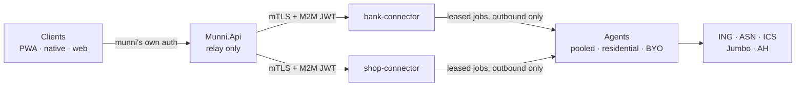

# munniscrape — design documents

Two privately-hosted connector products that give munni read access to
data open banking and public APIs cannot reach: **bank accounts outside
PSD2 scope** (savings, credit cards) and **retail receipts**.

Read in this order:

| # | Document | What it answers |
| --- | --- | --- |
| 1 | [connector-platform-design.md](connector-platform-design.md) | The master plan. Why two services, the three-plane architecture, the four runtime tiers, credential custody, bring-your-own agents, security posture, IaC/CI, delivery slices. **Start here.** |
| 2 | [connector-api-spec.md](connector-api-spec.md) | The wire contract. Provider manifest schema, the provider-namespaced HTTP surface, session/ticket/challenge protocols, the agent protocol, error taxonomy, sealed bundle format. |
| 3 | [bank-connector-service.md](bank-connector-service.md) | The bank product. ING, ASN (incl. the persistent edge-login case), ICS. Bank-specific rules — above all, never auto-retry a login. |
| 4 | [shopping-connector-service.md](shopping-connector-service.md) | The shopping product. Albert Heijn, Lidl Plus, Jumbo — each profiled from its public reference implementation. Egress and bot-protection engineering. |
| 5 | [munni-integration-plan.md](munni-integration-plan.md) | The **consumer specification**: what an app calling these connectors must implement. Written against munni, which is separately managed. |
| 6 | [execution-modes-design.md](execution-modes-design.md) | Where a browser runs and whose session it uses: HTTP-only, agent-local, a containerised browser service, and the two bring-your-own halves (dedicated profile vs attached to the user's live Chrome). Includes how to run the same system headed locally and headless in containers. |
| — | [overnight-report.md](overnight-report.md) | **Start here after 2026-07-28.** What was built overnight, what is proven, and — more importantly — what is fixture-tested only and must not be trusted until a live run. |
| — | [research/](research/) | Per-retailer findings: which of the ~50 Dutch retailers have a real API, a reverse-engineered mobile API, or only a browser. Every claim marked CONFIRMED-from-source or UNVERIFIED. |
| — | [connection-service-design.md](connection-service-design.md) | **Superseded** first pass (2026-07-22). Kept for the reasoning that carried over. |

## Implementation decisions (2026-07-27)

Settled when construction started. Where these differ from the design
documents, **these win** — the docs describe the intent, this records what
was actually built.

| Decision | Choice | Why |
| --- | --- | --- |
| Repository | **Monorepo** in `munniscrape`: `connector-kit/`, `bank-connector/`, `shop-connector/` | Deployment isolation is what the quarantine argument actually needs — separate images, databases, stacks, hostnames and kill switches — and all of that is preserved. Only the source lives together. A split later is a `git filter-repo` away. |
| Naming | `Connector.Kit`, `BankConnector.*`, `ShopConnector.*` | Descriptive namespaces and image names. Deployed hostnames stay neutral. |
| Stack | .NET 10, Postgres 18, Playwright for .NET, xUnit | Matches the reference architecture, so Docker/GHCR/NAS/IaC patterns transfer. |
| Control plane | **A library, not two services** — `Connector.Kit.Hosting` | The two products' control planes are near-identical (catalogue, sessions, jobs, challenges, agents). Each product's API is a thin shell that registers providers and calls `MapConnectorApi()`. This is what makes "two products, one shared kit" real rather than aspirational. |
| Agent runtime | Likewise a library — `Connector.Kit.Agent` | Same reasoning. It is also the only assembly carrying a browser. |
| Tickets | `ITicketStore` with an in-memory implementation | The design mentioned Valkey; a single-node deployment does not need it, and dropping it removes a moving part. The interface is where Valkey goes if replicas ever arrive. |

### The frozen contract

`connector-kit/src/Connector.Kit/` is the shared contract: manifests and
their validator, the error taxonomy, sealed bundles, normalisation, the
adapter interface, and the agent wire protocol. Everything else compiles
against it.

Three invariants live there specifically so no adapter author can
weaken them:

1. **`invalid_credentials` is non-retriable as a table constant**, alongside
   a `NeverRetry` set. Three retries locks a real bank account.
2. **`ManifestValidator` refuses to boot on a lying manifest** — server
   custody without unattended fetching, a browser runtime with no agent,
   a password field not marked secret, `unattended_fetch` without a refreshable
   session. A manifest that overpromises makes the consuming app promise
   users something and then fail.
3. **Money units are declared, never guessed.** There is deliberately no
   cents-versus-euros heuristic; adapters declare the unit per field and
   the result is checked against the provider's own stated total.

## The shape in one diagram

## The five ideas everything else follows from

1. **Quarantine.** Private endpoints, headless browsers and plaintext
   credentials live in services with their own domains, databases, egress
   and kill switches — never in the licensed AISP consumer.
2. **Pipes, not stores.** Connectors normalise and hand over, then
   forget. Staged data is purged on ack, or after 24 hours regardless.
3. **The manifest is the contract.** Each provider declares its auth
   flow, its fields, the challenges it may raise, where its secret lives
   and what resources it serves. munni renders forms from it and needs no
   change when a provider is added.
4. **Custody is a declared property.** `client` (sealed bundle on the
   user's device, the default), `server` (vault, only where unattended fetching
   sync is actually possible), or `agent` (the user's own machine — the
   connector never holds anything). Native devices keep bundles; **web
   holds them for the tab session only and re-authenticates each visit** —
   unless a BYO agent is in play, in which case web is fully persistent.
5. **Agents connect outbound only.** Which is what makes residential
   egress, and bring-your-own hardware, work without a redesign.

## Where the facts come from

Provider behaviour is taken **only** from public reference
implementations, read directly:

| Provider | Reference |
| --- | --- |
| Albert Heijn | [`gwillem/appie-go` v0.0.12](https://github.com/gwillem/appie-go/tree/v0.0.12) |
| Lidl Plus | [`yagueto/lidl-plus`](https://github.com/yagueto/lidl-plus) |
| Jumbo | [`DanielOostdam-Create/jumbo-cli`](https://pkg.go.dev/github.com/DanielOostdam-Create/jumbo-cli) |

Anything not confirmable from a reference is marked **`unconfirmed`**
rather than guessed. Reading those references has already overturned two
core assumptions:

- **Jumbo** has no refresh token and a ~24 hour session, which moves it
  from the easy tier to the hard one (shopping plan §3.3).
- **Albert Heijn is not the no-agent provider.** It was planned as T1 with
  a `redirect` challenge — the user logs in on AH's own page and pastes back
  the `appie://` URL their browser cannot open — which would have made it
  the one provider needing no agent at all. That paste step is not
  completable on a phone, so AH is now **T2 `browser_once`**: the connector
  signs in with a username and password in a headless browser and lifts the
  one-time code out of the redirect itself. **AH requires the agent**, for
  fetches as well as logins (shopping plan §3.2). No real provider sits on
  T1 any more; only the mock fleet does.

Reading them a second time, at implementation, also corrected three AH
details that had been guessed rather than confirmed — the client id
(`appie-ios`, not `appie`), a mandatory `x-client-*` / `x-application`
header block, and receipts being GraphQL at `POST /graphql` rather than
REST. The client id is the one that broke the first live login attempt, and
it broke it in the most misleading way available: a wrong client id fails
the token exchange *after* a sign-in that visibly succeeded, so it reads as
a bad password.

## Reference material in `temp/` — context only, never a code source

`temp/munni (Copy)` — a **read-only** snapshot of a separately managed
project, kept for architectural context: .NET 10 vertical slices,
Docker/GHCR multi-arch, Synology NAS deploy, `infra/` IaC. **It is never
edited from this repo**, and its shopping integration is not a source of
provider facts — it describes Jumbo incorrectly.

`temp/scapegoat-main` — a knowledge pool. It demonstrates that Playwright
against a real bank UI, with 2FA relayed to a human, works in practice.
**No code is reused from it**; it was built for a different product
around patterns this plan deliberately does not repeat.
