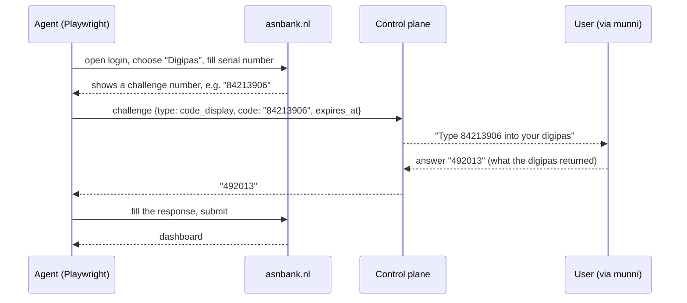

# Bank Connector — service plan

Repo: `bank-connector` · Working service identity: **ledgerbridge**
(placeholder, see platform design §9) · Kind: `bank`

Reads: [connector-platform-design.md](connector-platform-design.md) ·
[connector-api-spec.md](connector-api-spec.md)

---

## 1 · Scope

munni is an account-information **consumer**: read-only bank data through
a licensed AISP (GoCardless / Enable Banking), SCA at the bank,
credentials never touched. That covers **payment accounts only**. This
service covers what PSD2 does not:

| Gap | Why open banking doesn't help |
| --- | --- |
| Savings accounts | Out of PSD2 scope — most ASPSPs expose only the current account |
| Credit cards (ICS, Amex, bank-issued) | Separate issuer, no AIS endpoint |
| Sub-accounts, children's accounts, "potjes" | Not exposed as separate payment accounts |
| Banks with no AISP coverage | Not in the aggregator's catalogue at all |

**Explicit non-goal: current accounts that open banking already serves.**
If GoCardless can read it, munni reads it there. This service is the
fallback for the gaps, never a cheaper substitute for the licensed path.
That boundary is what keeps the regulatory story clean, and it belongs in
the product copy as well as here.

Also out of scope, permanently: payment initiation. There is no code path
anywhere in this service that moves money, and there never will be.

---

## 2 · Provider profiles

### 2.1 ING (NL) — the provider that started this

**What we need from it:** savings accounts and credit-card transactions,
which open banking does not expose.

Unlike the shopping providers, there is no public reference
implementation to work from — ING's flow has to be established by a
discovery spike against a live account (§6.1). The manifest below is
therefore a **shape**, not a finding: the fields and challenge types are
what a Dutch retail bank login needs, and the spike confirms or corrects
them before B1 is estimated.

```jsonc
{
  "id": "ing", "name": "ING", "kind": "bank", "country": "NL",
  "runtime": "browser_interactive",              // T3
  "agent": { "required": true, "class": "pooled",
             "egress": { "country": "NL", "kind": "residential" } },
  "unattended": false,                            // SCA every login
  "secret_custody": "client",
  "auth": {
    "flow": "two_step",
    "steps": [
      { "id": "credentials", "fields": [
          { "key": "username", "type": "text",     "secret": false, "label_key": "connect.field.username" },
          { "key": "password", "type": "password", "secret": true,  "label_key": "connect.field.password" } ] }
    ],
    "challenges": ["app_approval", "code_display", "mfa_code", "select_option"],
    "session": { "artifact": "sealed_bundle", "ttl_seconds": 604800,
                 "refreshable": false, "rotates_on_use": true },
    "reauth": { "cheap": false, "trigger_codes": ["session_expired"] }
  },
  "resources": [
    { "id": "accounts",     "endpoint": "GET /v1/ing/accounts", "returns": "account" },
    { "id": "transactions", "endpoint": "GET /v1/ing/transactions", "returns": "transaction",
      "params": [
        { "key": "accounts", "type": "enum", "multi": true,
          "values": ["current", "savings", "credit_card"], "required": false },
        { "key": "since", "type": "date", "required": true },
        { "key": "until", "type": "date" } ],
      "max_history_days": 540, "typical_duration_seconds": 90 }
  ],
  "limits": { "min_interval_seconds": 21600, "concurrency": 1 }
}
```

This is the user's example endpoint made concrete:

```http
GET /v1/ing/transactions?accounts=savings,credit_card&since=2026-01-01
```

**Login shape.** ING is `two_step` with a `mobile_approval` or
`code_display` challenge depending on the user's configured method. The
adapter does not need to know which in advance — it raises whichever
challenge it encounters, and munni renders it from the typed payload.

**Why `unattended: false`.** ING requires strong authentication on every
login. There is no refresh path and therefore nothing worth storing
server-side — which is why `secret_custody` is `client` and the vault is
not offered for this provider. Storing a password that cannot be used
without a human is pure risk for zero feature.

**Session reuse.** The `storageState` goes into the bundle with a 7-day
TTL. In practice ING invalidates it sooner; the adapter must treat a
mid-run redirect back to the login page as `session_expired`, not as a
parse failure.

### 2.2 ASN (NL) — the persistent-agent case

**Why it matters:** ASN's "edge login" keeps a browser logged in
indefinitely. Point a BYO agent at it once and transactions can be pulled
forever without the user authenticating again. This is the entire
justification for the T4 tier and the BYO agent protocol.

Two manifests, because ASN genuinely offers two different products:

```jsonc
// 2.2a — pooled, interactive: works today, needs a human every run
{
  "id": "asn", "name": "ASN Bank", "kind": "bank", "country": "NL",
  "runtime": "browser_interactive",             // T3
  "agent": { "required": true, "class": "pooled", "egress": { "country": "NL", "kind": "residential" } },
  "unattended": false,
  "secret_custody": "client",
  "auth": {
    "flow": "challenge_response",
    "steps": [ { "id": "device", "fields": [
        { "key": "serial_number", "type": "text", "secret": false,
          "label_key": "connect.asn.serial", "pattern": "^[0-9]{8,12}$" },
        { "key": "method", "type": "select", "options": ["digipass", "app_qr"],
          "label_key": "connect.asn.method" } ] } ],
    "challenges": ["code_display", "mfa_code", "qr_display"],
    "session": { "artifact": "sealed_bundle", "ttl_seconds": 3600, "refreshable": false }
  },
  "resources": [
    { "id": "accounts", "endpoint": "GET /v1/asn/accounts" },
    { "id": "transactions", "endpoint": "GET /v1/asn/transactions",
      "params": [ { "key": "since", "type": "date", "required": true },
                  { "key": "until", "type": "date" },
                  { "key": "format", "type": "enum", "values": ["camt053"], "internal": true } ],
      "max_history_days": 540 }
  ]
}
```

The digipass flow maps cleanly onto the platform's `code_display`
challenge — the one case where the code travels *outward* to the human
rather than inward from them:



The QR variant is the same shape with `qr_display` — the agent screenshots
the QR region and the human scans it with the ASN app. Note what the
platform adds over the naive implementation of this (open the page, wait
five minutes for the URL to change): a real `expires_at`, so a run the
user abandoned fails cleanly and releases its agent instead of holding a
browser hostage for the full timeout.

```jsonc
// 2.2b — BYO agent, persistent: the goal state
{
  "id": "asn-persistent", "name": "ASN Bank (always-on)", "kind": "bank", "country": "NL",
  "runtime": "browser_persistent",              // T4
  "agent": { "required": true, "class": "byo" },
  "unattended": true,                            // ← the payoff
  "secret_custody": "agent",                     // the connector never holds anything
  "auth": {
    "flow": "device_persistent",
    "steps": [ { "id": "agent", "fields": [
        { "key": "agent_id", "type": "select", "label_key": "connect.asn.pick_agent",
          "options_from": "GET /v1/agents?subject=" } ] } ],
    "challenges": ["qr_display", "code_display"],   // once, at enrollment
    "session": { "artifact": "sealed_bundle", "ttl_seconds": 31536000, "refreshable": true }
  },
  "resources": [ /* same as 2.2a */ ]
}
```

The bundle for this manifest contains **no secret at all** — only
`{ agent_id, profile_id }`. The login state lives in a Playwright
persistent profile on the user's own machine. Jobs route exclusively to
that agent; if it is off, the fetch fails with `agent_unavailable` and
`user_action: start_your_agent`.

**The honest caveat to put in front of the user:** an always-logged-in
browser profile on a machine they control is a real, ongoing bank session.
It is safer than handing a password to a service, and more dangerous than
having no session at all. The setup flow must say so plainly, and the
agent must ship with a documented "revoke and wipe" path (`DELETE
/v1/agents/{id}` plus a local profile purge).

### 2.3 ICS / credit cards

`icscards.nl` (the issuer behind most Dutch bank-branded Visa/Mastercards)
is the highest-value remaining gap after ING savings: a credit card is
invisible to open banking but is where a lot of spending happens.

Expected shape: `browser_once` or `browser_interactive` with
`password` + `mfa_code`, resources `accounts` + `transactions`, statement
periods rather than free date ranges (so `since`/`until` snap to statement
boundaries — the adapter normalises, the caller does not care).

Deferred to **B5** because it needs a live account to reverse-engineer and
ING is the bigger win.

### 2.4 `mock-bank` — built first, kept forever

Ships in **B0**, before any real provider. It exercises every tier and
every challenge type against a local fixture server:

- `mock-bank-simple` — T1, password only, instant success
- `mock-bank-sca` — T3, raises `code_display` then `app_approval`
- `mock-bank-slow` — T3, 60-second run, exercises SSE and lease renewal
- `mock-bank-broken` — always fails with `provider_changed`, for testing
  the operator alert path
- `mock-bank-persistent` — T4, exercises BYO agent routing

munni's **demo identity** connects to `mock-bank-simple`, which is what
lets the demo user see a full bank-connection flow while keeping munni's
zero-network law intact for demo/offline (the connector call happens
server-side, and the demo path never reaches it — see the integration
plan).

---

## 3 · The one rule that outranks everything

**A failed login is never retried automatically.** Not by the job queue,
not by the agent, not by a scheduler, not after a deploy, not after a
lease expiry.

Three failed attempts locks a real bank account, and an account lockout
is a support incident that no amount of good architecture makes up for.
Concretely:

- `invalid_credentials` is `retriable: false` as a compile-time constant
  in `connector-kit`, not a per-adapter policy.
- A `login` job whose lease expires (dead agent) returns to the queue
  **exactly once**, and only if it had not yet submitted a credential
  upstream. The agent reports `credential_submitted: true` in its first
  progress call after typing a password; after that flag, a lost lease
  fails the job permanently.
- A scheduler never enqueues a `login`. Only a `fetch` or `refresh`, and
  only against a session already `active`.

---

## 4 · Bank-specific engineering notes

### 4.1 Banks hand over files, not JSON

The structural difference from the shopping side: retail providers return
JSON from an API, banks return a **downloaded export** — CAMT.053 XML,
MT940, or CSV — produced by a form the browser has to fill in. That
shapes the adapter:

- **The download is part of the browser session.** The agent drives a
  date range and a format into an export form, waits for the file, and
  parses it. There is no endpoint to call directly.
- **Parsers belong in `connector-kit`, not in adapters.** CAMT.053 is a
  standard; a single well-tested implementation serves every bank that
  offers it, and each adapter only maps the standard's fields onto the
  normalised transaction. Write it once, with a fixture suite covering
  each bank's dialect of it — banks differ in which optional elements
  they populate, and that is a fixture problem, not a code-branch problem.
- **CSV exports need locale-tolerant parsing.** Dutch bank exports vary
  in column headers (Dutch or English depending on the user's interface
  language), decimal separator, and date format — sometimes between
  exports from the same bank. The parser resolves columns by matching a
  set of known header aliases rather than by position, and fails loudly
  with `provider_changed` when it cannot resolve one, rather than
  silently mapping the wrong column.
- **Files touch disk, so they must be cleaned up.** Downloads go to a
  per-job temporary directory that is deleted in a `finally` block,
  including on failure. A bank statement left on an agent's disk is
  exactly the kind of residue this architecture exists to avoid.

### 4.2 The balance-chain invariant

Where a provider exposes a running balance per transaction, that balance
is a free integrity check and should be treated as a required one.

For each adjacent pair, the earlier transaction's resulting balance
adjusted by the later transaction's signed amount must equal the later
transaction's resulting balance. Any mismatch means one of: rows arrived
in an unexpected order, a decimal separator was misread, a debit/credit
flag was inverted, or a row was dropped. Every one of those produces
plausible-looking output that a human reviewer would not catch.

Any adapter whose provider exposes a running balance implements
`IBalanceChainVerifiable`, and the kit runs the check before
normalisation. Failure is `provider_changed` — the export shape moved —
not `internal`, and the run fails rather than emitting data it cannot
vouch for.

This is worth stating as a general principle: **where a provider gives us
a redundant fact, check it.** Running balances, stated totals versus
summed line items (shopping plan §4.2), transaction counts in an export
header. Redundancy that goes unchecked is redundancy wasted.

### 4.3 Account discovery and the `accounts` parameter

`GET /v1/ing/transactions?accounts=savings,credit_card` filters by
**account type**, not by account id, because the caller often does not
know the ids yet. The adapter resolves types to the concrete accounts it
found during login (recorded in the bundle's `accounts` array), so:

- omitting `accounts` means "everything this session can reach";
- naming a type the session cannot reach is `unsupported_resource`, with
  the reachable set in the error detail — not a silent empty result;
- `GET /v1/ing/accounts` is the cheap discovery call, served from the
  bundle without touching the provider at all when the data is fresh.

### 4.4 History windows and the reserved-transaction problem

A bank export shows *booked* transactions. A card payment made on the
19th may not appear until it settles on the 21st — and it then appears
dated the 19th, behind a cursor that has already moved past it. Fetching
strictly `since last_sync` therefore loses transactions permanently.

Every bank adapter declares a `settlement_lag_days` (14 is a safe default
for Dutch card payments) and the kit widens any `since` by that amount
automatically. Deduplication by `content_hash` makes the overlap free, so
the only cost is a slightly larger export.

This is a correctness requirement, not an optimisation: without it the
service silently loses data, and the loss is invisible because the
missing rows never existed from the consumer's point of view.

### 4.5 Egress

Bank fraud systems weigh IP reputation and geography heavily. A Dutch
bank login from a datacenter range is a fraud signal even when everything
else is correct. The pooled browser agent for this service **must** run on
a residential Dutch line — the same box as the shopping connector's agent
is fine, or a BYO agent, but never the NAS's own egress and never a cloud
host.

Corollary: no proxy rotation, ever. A stable, honest residential IP is
both the safer engineering choice and the one that matches what this
service actually is.

---

## 5 · Slices

| | Slice | Delivers | Depends on |
| --- | --- | --- | --- |
| **B0** | Repo, `bank-connector-api` + `bank-connector-agent` images, IaC stacks (`bank-staging`, `bank-prod`), control plane on `mock-bank-*`, munni client, mTLS + M2M wiring | end-to-end integration and demo users, with zero real providers | K0 |
| **B1** | **ING** savings + credit card, T3 Playwright, `app_approval` / `code_display` / `mfa_code`, residential pooled agent | the gap that started the project | K1, K2, B0 |
| **B2** | Transaction normalisation, CAMT.053 in the kit, balance-chain verifier, delta cursors + ack, `settlement_lag_days` | munni ingests bank data as an ordinary feed | B1 |
| **B3** | **BYO agent**: enrollment codes, profile affinity, agent health, revoke-and-wipe, munni's agent UI | the prerequisite for B4 — **and for the shopping service's Jumbo-persistent slice**, so it serves two products | B0 |
| **B4** | **ASN** — T3 digipass/QR first, then the T4 persistent edge-login profile on a BYO agent | truly unattended bank sync | B3 |
| **B5** | **ICS / credit cards**; `server` custody + vault behind an explicit opt-in for whichever providers turn out to be `unattended: true` | nightly sync without a human | B2 |
| **B6** | Canaries per provider, failure artifacts, operator console, metrics | the fleet stays maintainable | B1 |

---

## 6 · Open questions specific to this service

1. **ING's actual login and export flow — a blocking discovery spike.**
   Unlike the shopping providers there is no public reference
   implementation, so B1 cannot be estimated until a session against a
   live account establishes: which challenge types the login actually
   raises, whether savings and credit-card transactions come from one
   export or several, what formats the export form offers, and what the
   real history limit is. The parse side can then be built offline from
   captures; only the drive side needs the live session.
2. **Does the user want current accounts here at all** as a fallback when
   GoCardless quota is exhausted? §1 says no. Saying yes changes the
   regulatory framing materially and should be a deliberate decision.
3. **ASN persistent-profile lifetime** — how long does an edge-login
   profile actually survive in practice? If it is weeks rather than
   months, T4's value drops and B4 should be reordered behind B5.
4. **Vault (B5)** — offered to end users, or operator-only for canary
   accounts? The platform supports both; only the product copy differs.
