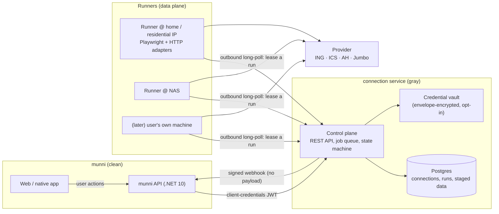

# munniscrape — connection service design

> **SUPERSEDED 2026-07-27** by
> [connector-platform-design.md](connector-platform-design.md) and its
> companions. That plan splits this single service into two products
> (bank + shopping) sharing a `connector-kit`, replaces the generic
> `/connections/{id}/runs` surface with provider-namespaced routes driven
> by a machine-readable provider manifest, introduces the sealed session
> bundle for device-held credentials, and makes bring-your-own agents a
> day-one protocol rather than a later slice.
>
> Kept for the reasoning that carried over: the quarantine argument (§1),
> the critique of `scapegoat` (§2), the challenge taxonomy (§5.4), the
> error rules (§5.6), retention (§7) and posture (§8).

Status: SUPERSEDED. Original: PROPOSAL 2026-07-22, first design pass.

## 1 · Why this service exists

munni is a licensed-AISP consumer: read-only bank data via GoCardless /
Enable Banking, SCA at the bank, credentials never touched. That covers
**payment accounts only**. It does not cover:

| Gap | Why open banking doesn't help |
| --- | --- |
| Savings accounts | Out of PSD2 scope — most ASPSPs expose only the current account |
| Credit cards (ICS, Amex, bank-issued) | Separate issuer, no AIS endpoint |
| Supermarket receipts (AH, Jumbo, Lidl, …) | No public API at all; only the mobile app's private endpoints |
| Loyalty / subscriptions / utilities | Same — web portals, no API |

Today munni fills part of that gap itself: `apps/web/src/features/shopping/stores/*`
drives AH/Jumbo's mobile endpoints from the browser through
`server/src/Munni.Api/Shopping/StoreProxyEndpoints.cs` — a pass-through
proxy in the *licensed* app's API. That is the thing this project ends.

**The core idea: quarantine.** Everything unofficial — private mobile
APIs, headless-browser scraping, credential handling — moves into a
separate service with its own domain, database, deployment, egress IPs,
legal entity-ish posture and blast radius. munni becomes a plain HTTP
consumer of a boring, well-typed API. If a supermarket sends a cease and
desist, or an IP gets blocked, or a scraper leaks — it lands here, not on
the app that holds people's finances.

Second idea, equally important: **the service is a pipe, not a store.**
It normalizes and hands over, then forgets. It must not become the
honeypot that holds both retail credentials *and* everyone's transaction
history.

> Naming: `munniscrape` is fine as a repo name. The deployed service
> should get a neutral identity (its own domain, no "munni" and no
> "scrape" in it) — quarantine is undermined if the hostname advertises
> both the parent app and the technique.

## 2 · What I'd change versus the references

**From `scapegoat`** (keep): Playwright driving the real bank UI, jobs
with live status a user can watch, encrypted credential storage,
2FA challenge codes surfaced to the user, mock provider for demo users.

**From `scapegoat`** (drop):
- One controller + one service *per provider* (`IngTransactionsFetcher`,
  `AsnTransactionsFetcher`, `MockIngTransactionsFetcher`). It does not
  scale past three providers. → one generic API, providers are plugins.
- Job status as free-text Hangfire job parameters (`"Logging in to ING"`).
  → a typed step/progress model the consumer can render and translate.
- Scraper pushes results into the consuming app's API
  (`_api.PostForAppAsync(...)`). Inverted dependency: the gray service
  holds credentials *for* the clean app. → the consumer **pulls**; this
  service never calls munni except for a signed, payload-free webhook.
- Provider-shaped output (`IngTransactionModel`, `CAMT053Model`) →
  one normalized schema, raw kept only for debugging.
- Mongo + Hangfire + Azure AD. → Postgres (munni already runs 18), a
  leased job table, and client-credentials JWT. Fewer moving parts, and
  a leased job table is what makes remote runners possible (§4).

**From `munni`** (keep and generalize): the AH/Jumbo adapters, the
receipt/matching data shapes (`storeReceipts.ts` — amounts in cents,
IBAN-tail payment matching), the demo/offline zero-network gate.

**From `munni`** (retire): `StoreProxyEndpoints` and the on-device store
adapters move here. `docs/store-connection-sync-design.md` (E2EE device
enrollment for syncing store logins across devices) becomes largely
unnecessary — see the tradeoff in §6, it's the one real product decision
in this plan.

## 3 · The user-facing shape (what the API must make possible)

Design the API backwards from these four screens in munni:

1. **"Connect an account"** — a catalog: which providers exist, what
   each can deliver, whether it's healthy right now, what login it needs.
2. **"Logging you in…"** — a live progress line, and sometimes a
   question: *enter the SMS code*, *approve in your banking app*,
   *scan this QR*, *type code 4821 in your app*, *paste the address you
   were redirected to*. This handshake is the hard part of the whole
   design and most of the API surface.
3. **"Your connections"** — state per connection, last sync, next sync,
   plain-language reason when broken, disconnect.
4. **"New data"** — deltas since the last pull, idempotent.

Everything below serves those.

## 4 · Architecture: control plane + pull-based runners



Three properties fall out of this split, and they're the reason for it:

- **Egress control.** Jumbo's bot protection tarpits datacenter IPs —
  munni's proxy already returns 502/504 for exactly this reason. Runners
  connect *outbound only*, so they can sit behind NAT on a residential
  line while the control plane stays on normal hosting.
- **The control plane never touches a provider.** It's an ordinary CRUD
  + queue service. All gray traffic, browser binaries, and plaintext
  credentials-in-memory live in the runner process.
- **"Bring your own runner"** becomes possible later: a privacy-maximal
  user runs the runner on their own machine, and their credentials never
  leave their house. Same protocol, no redesign. Worth keeping the runner
  contract language-agnostic HTTP/JSON for this reason alone.

**Stack recommendation:** .NET 10 minimal API for the control plane and
.NET + Playwright for the first runner — same stack as munni's server and
as scapegoat, so deployment, Docker and NAS patterns carry over. The
runner protocol stays plain HTTP/JSON so a TypeScript runner can be added
if a provider adapter is easier to write against the JS ecosystem.

## 5 · The API

Base `https://<host>/v1`. All amounts in **minor units** + ISO currency.
All ids opaque and prefixed (`con_`, `run_`, `acc_`, `txn_`, `rcp_`).
All mutating calls take `Idempotency-Key`.

### 5.1 Auth model

munni's **server** is the only client — the browser never talks to this
service. Client-credentials JWT (or mTLS) identifies munni; every
resource carries a `subject`: a **pseudonymous, munni-minted user id**.
The service never learns an email, a name, or a munni user id. Access is
enforced as `token.client == connection.client && subject matches`.

### 5.2 Catalog

```
GET /v1/providers
```
```json
{ "providers": [{
  "id": "ing-nl",
  "name": "ING",
  "kind": "bank",
  "country": "NL",
  "capabilities": ["accounts", "balances", "transactions"],
  "account_types": ["savings", "credit_card"],
  "auth": {
    "method": "credentials",
    "fields": [{ "key": "username", "type": "text" }, { "key": "password", "type": "password" }],
    "challenges": ["app_approval", "code_display"]
  },
  "unattended": true,
  "history_days_max": 540,
  "min_sync_interval_seconds": 21600,
  "status": { "state": "healthy", "since": "2026-07-20T09:00:00Z" }
}]}
```

`status` is what lets munni degrade honestly — "Jumbo connections are
paused, we're fixing it" instead of a mystery spinner. `unattended` tells
munni whether scheduled sync is even offerable for this provider.

### 5.3 Connections

```
POST   /v1/connections          { provider, subject, label?, credential_mode, consent }
GET    /v1/connections?subject=
GET    /v1/connections/{id}
POST   /v1/connections/{id}/reauth
DELETE /v1/connections/{id}      → provider-side logout if possible, then purge
```

State machine — deliberately small, and every terminal state has a
user-facing meaning:

```
                 ┌──────────────► blocked (provider refuses us)
pending_auth ──► active ──► needs_reauth ──► (reauth run) ──► active
                    └────► disabled (user or operator)
```

`consent` is recorded, not implied: `{ accepted_at, terms_version,
scopes: ["transactions"] }`. This is a user acting on their own account
through an agent; the record is what makes that defensible.

### 5.4 Runs — the interactive part

One resource for both login and sync, because both can stop and ask a
question mid-flight.

```
POST /v1/connections/{id}/runs
  { "type": "connect" | "sync", "scope": { "resources": ["transactions"], "since": "2026-06-01" },
    "credentials": { "username": "...", "password": "..." }   // ephemeral mode only
  }
→ 202 { "id": "run_…", "state": "queued" }

GET  /v1/runs/{id}
GET  /v1/runs/{id}/events        (SSE — live progress for the "logging you in…" screen)
POST /v1/runs/{id}/input         { "challenge_id": "chl_…", "value": "492013" }
POST /v1/runs/{id}/cancel
```

Run states: `queued → running → (awaiting_input ⇄ running) → succeeded | failed | expired`.

Progress is typed, not prose — munni renders and translates it:

```json
{ "state": "running", "step": "authenticating",
  "steps_done": ["queued", "runner_assigned", "opening_provider"],
  "started_at": "…", "expires_at": "…" }
```

Challenge types — this list is the real product surface, derived from
what NL banks and retailers actually do:

| type | payload | user does |
| --- | --- | --- |
| `mfa_code` | `{ length, delivery: "sms"\|"totp"\|"email" }` | types a code |
| `app_approval` | `{ hint: "Approve in the ING app" }` | nothing — we wait |
| `code_display` | `{ code: "4821" }` | types **our** code into the bank app |
| `qr_display` | `{ qr_png_base64, expires_at }` | scans with the bank app |
| `select_option` | `{ options: [...] }` | picks an account/profile |
| `redirect` | `{ url, return_pattern: "appie://login-exit*" }` | logs in in their own browser, pastes the redirect back (AH today) |
| `captcha` | `{ image \| sitekey }` | *(deliberately unsupported — see §8)* |

`expires_at` is mandatory on every challenge: a Playwright session behind
it is burning a browser, and a stale run must fail cleanly rather than
hold a runner hostage.

### 5.5 Data — normalized, delta, idempotent

```
GET /v1/connections/{id}/accounts
GET /v1/connections/{id}/transactions?cursor=&limit=
GET /v1/connections/{id}/receipts?cursor=&limit=&include=items
POST /v1/connections/{id}/ack   { "cursor": "…" }     ← "delivered, you may purge"
```

```json
// account
{ "id": "acc_…", "external_id": "NL91INGB0417164300", "type": "savings",
  "display_name": "Oranje Spaarrekening", "iban": "NL91…", "masked_number": "•••• 1234",
  "currency": "EUR", "balance": { "value": 1250045, "as_of": "2026-07-22T04:10:00Z" } }

// transaction
{ "id": "txn_…", "external_id": "…", "account_id": "acc_…",
  "booked_at": "2026-07-19", "value_at": "2026-07-19",
  "amount": { "value": -4231, "currency": "EUR" },
  "counterparty": { "name": "JUMBO 1234 UTRECHT", "iban": null },
  "description": "Betaalautomaat 19-07-2026 17:42",
  "kind": "card_payment", "content_hash": "sha256:…" }

// receipt  (shapes chosen to fit munni's existing matcher)
{ "id": "rcp_…", "external_id": "…",
  "merchant": { "id": "jumbo", "name": "Jumbo", "store_name": "Jumbo Utrecht CS" },
  "purchased_at": "2026-07-19T17:42:00+02:00",
  "total": { "value": 4231, "currency": "EUR" },
  "payment": { "method": "card", "card_last4": "1234", "iban_tail": "4300" },
  "items": [{ "name": "Melk halfvol 1L", "quantity": 2,
              "unit_price": { "value": 119 }, "total": { "value": 238 },
              "discount": { "value": -30, "label": "2e halve prijs" } }] }
```

`content_hash` + `(connection_id, external_id)` uniqueness gives free
idempotency: re-running a sync never duplicates, and munni can safely
retry a pull.

### 5.6 Errors — a taxonomy, never a bare 500

```json
{ "error": { "code": "invalid_credentials", "retriable": false,
             "user_action": "reauth", "message_key": "connect.error.invalid_credentials",
             "detail_id": "err_…" } }
```

`invalid_credentials` · `mfa_failed` · `mfa_timeout` · `blocked_by_provider`
· `provider_changed` · `provider_unavailable` · `rate_limited` ·
`consent_expired` · `runner_unavailable` · `internal`.

Two rules that matter more than the list:
- **`message_key`, not English prose.** munni owns the copy in nl/en/tr.
- **`invalid_credentials` never auto-retries.** Three retries locks a
  real bank account. This is the single highest-consequence bug this
  service can have; it belongs in the design, not in a code review.

`provider_changed` (a selector vanished) pages the operator and flips the
provider's `status` to `degraded` — that's the self-defending loop that
keeps a scraper fleet maintainable.

### 5.7 Webhooks

Signed (`X-Signature: t=…,v1=hmac-sha256`), replay-windowed, **payload-free**:
`run.state_changed`, `run.input_required`, `connection.state_changed`,
`data.available`, `provider.status_changed`. Event says *something
happened*; munni pulls the data over its authenticated channel. No
financial data ever rides a webhook body.

### 5.8 Runner protocol (internal)

```
POST /internal/runners/heartbeat        { runner_id, capabilities, egress_region }
POST /internal/runs/lease               (long-poll) → run + decrypted material, one-shot
POST /internal/runs/{id}/progress       { step, steps_done }
POST /internal/runs/{id}/challenge      { type, payload, expires_at }
POST /internal/runs/{id}/result         { accounts, transactions, receipts }
POST /internal/runs/{id}/fail           { code, detail, artifacts? }
```

Leases have a TTL and are renewed by heartbeat; a dead runner's run
returns to the queue exactly once, then fails. Runner tokens are
per-runner and scoped to `/internal/*`.

## 6 · Credentials — the one real decision

Three positions, and the plan needs one chosen consciously:

| | Ephemeral | Vault (opt-in) | E2EE (munni holds ciphertext) |
| --- | --- | --- | --- |
| Service stores secrets | no | yes, envelope-encrypted | no |
| Scheduled/unattended sync | ✗ | ✓ | ✗ (device must be online) |
| Blast radius if service is breached | live runs only | stored secrets | nothing |
| Works when user has one device | ✓ | ✓ | ✓ |
| Multi-device without extra crypto | ✓ | ✓ | ✗ (needs the CSK/device-enrollment protocol) |

**Recommendation: ephemeral by default, vault as an explicit per-connection
opt-in, sold as what it actually is — "sync my savings account every
night without me".** Rationale:

- Unattended sync is the *only* feature that requires storage, and it's a
  genuinely valuable one (that's the whole point of a nightly bank job).
- Providers requiring per-login SCA can't be unattended anyway, so the
  provider catalog's `unattended` flag naturally splits the population;
  don't store what can't be used.
- **Session reuse is the cheap 80% win:** persist Playwright
  `storageState` / OAuth refresh tokens (encrypted, short TTL) so the
  second sync doesn't re-trigger a full login+2FA — without ever storing
  a password. Do this for every provider regardless of vault opt-in.
- Vault details: per-connection DEK, KEK in the host keystore/env (never
  in the DB), decrypt only at lease time, plaintext only ever in runner
  memory. Rotate on `needs_reauth`.

Consequence for munni: with the service holding the connection, the
proposed CSK/device-enrollment E2EE design for store logins can be
dropped — connections become account-scoped instead of device-scoped, so
"connect once, works on every device" falls out for free. That's a real
privacy-vs-convenience trade and the user-facing story has to change
honestly ("your supermarket login is stored, encrypted, by our connection
service" instead of "never leaves your device"). Deciding this is
prerequisite to slice S2.

## 7 · Data retention — stay a pipe

- Normalized rows are **staged**, not owned: purged on `ack`, or after a
  hard TTL (7 days) if munni never acks.
- Raw provider payloads: off by default; opt-in per provider for
  debugging, 24h TTL, never for a real user without a flag.
- Failure artifacts (screenshot + DOM snapshot) are the thing that makes
  broken scrapers fixable — keep them, but redacted, 72h TTL, operator-
  only, and never captured while a credential field is filled.
- `DELETE /connections/{id}` purges everything synchronously and, where
  the provider supports it, revokes the session upstream.

## 8 · Politeness and posture

Non-negotiables baked into the runner, not left to adapter authors:

- Per-connection concurrency 1; per-provider global rate limit; jittered
  schedules; no sync more often than `min_sync_interval_seconds`
  (6h default — human-plausible, not a firehose).
- Only the authenticated user's own data, only user-initiated or
  user-scheduled. No pooled accounts, no crawling, no scraping of
  anything behind someone else's login.
- **No CAPTCHA solving, no fingerprint spoofing beyond an honest mobile
  User-Agent, no proxy rotation to evade blocks.** If a provider
  deliberately blocks us, the adapter reports `blocked_by_provider` and
  the connection stops. Evasion is the line between "user's agent" and
  "abuse", and crossing it also destroys the quarantine argument.
- Provider ToS reality-check per adapter, recorded in the adapter README,
  plus a documented takedown/disable path (flip provider status → all
  connections pause, users get a real message).

## 9 · Adapter contract

Each provider is a plugin implementing:

```csharp
interface IProviderAdapter {
    ProviderDescriptor Describe();                 // → catalog entry (§5.2)
    Task<AuthResult> ConnectAsync(IRunContext ctx);  // login, may raise challenges
    Task<SyncResult> SyncAsync(IRunContext ctx);     // returns normalized records
}
```

`IRunContext` gives `Progress(step)`, `AskAsync(challenge) → answer`,
credentials, prior `storageState`, and a page/HTTP client. Adapters never
touch the DB, never call munni, never decide retry policy.

Keeping them alive:
- **Fixture tests**: every adapter has recorded responses/DOM snapshots;
  parsing is tested offline in CI. This is what catches a shape change on
  the parse side.
- **Canaries**: a scheduled run against a dedicated test account per
  provider; failure flips provider status and alerts before real users
  notice. Cheap, and the difference between "we knew" and "users told us".
- **Defensive parsing** everywhere (munni's `jumbo.ts` already models
  this well — tolerate cents vs euros, multiple field names).

## 10 · Slices

| | Slice | Delivers |
| --- | --- | --- |
| **S0** | Skeleton: control plane, auth, catalog, run state machine, leased queue, one runner, **`mock-bank` provider** | munni can integrate end-to-end, incl. demo users, before a single real provider exists |
| **S1** | AH receipts (token-based, no browser) + munni client replacing `StoreProxyEndpoints` | proves the pipe on the lowest-risk provider; deletes code from munni |
| **S2** | Challenge protocol + SSE + `redirect` and `mfa_code` types; Jumbo on a residential runner | the interactive login UX, and the bot-protection story |
| **S3** | ING savings + credit card via Playwright; `app_approval` / `code_display`; session reuse | the actual gap that started this |
| **S4** | Vault opt-in + scheduler (jittered nightly, `min_interval` enforcement) | unattended sync |
| **S5** | Canaries, provider health, failure artifacts, operator console, metrics | fleet stays maintainable |
| **S6** | Bring-your-own-runner | privacy-maximal option; also the answer if IP blocking gets bad |

S0+S1 is the honest MVP: it changes nothing user-visible but moves the
gray code out of munni, which is the actual point of the project.

## 11 · Open decisions

1. **Vault opt-in (§6)** — yes/no? Everything about scheduled sync and
   the retirement of the E2EE store-sync design hangs off it.
2. **Does munni's browser ever talk to this service directly?** This plan
   says no (server-to-server only) — simpler auth, no CORS, no service
   hostname in the app bundle. Costs one extra hop for SSE progress.
3. **Provider priority after ING** — ASN (scapegoat has the adapter
   already), ICS/credit cards, or more supermarkets?
4. **Where do runners live** on day one — NAS, or a residential box
   separate from the NAS? Determines how soon Jumbo can work at all.
5. **Multi-tenant later?** If this service might ever serve a second
   consumer app, the `client`/`subject` split above already supports it;
   if never, some of §5.1 can be simplified away.
