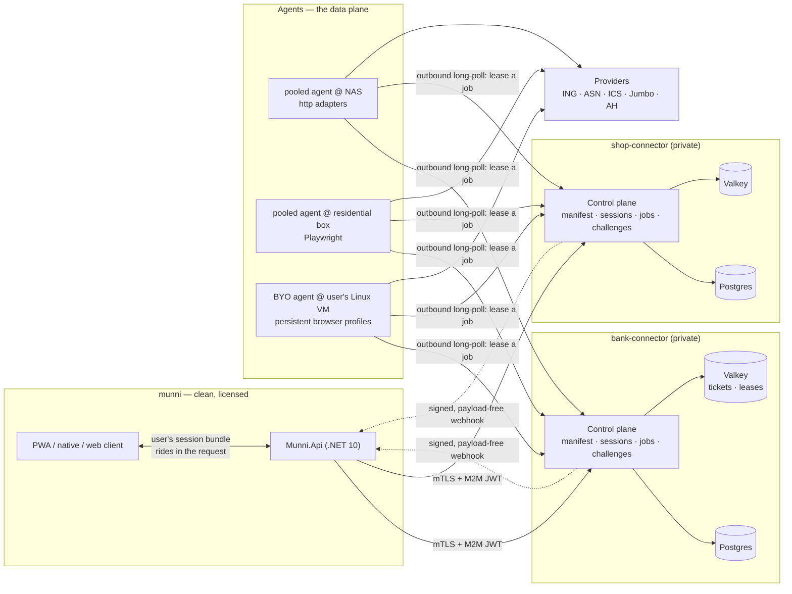
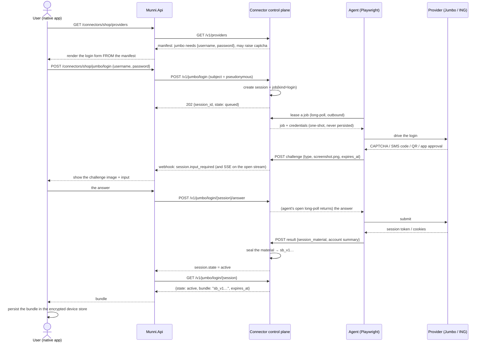
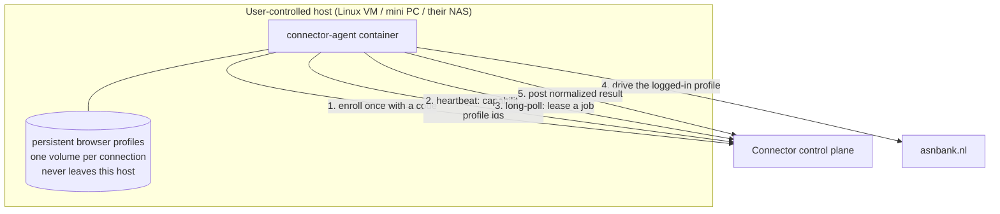

# Connector platform — master design

Status: **PROPOSAL 2026-07-27.** Supersedes `connection-service-design.md`
(kept in git history). Nothing built yet.

Companion documents:

| Doc | Covers |
| --- | --- |
| [connector-api-spec.md](connector-api-spec.md) | The wire contract: provider manifest schema, HTTP surface, session/challenge/agent protocols |
| [bank-connector-service.md](bank-connector-service.md) | The bank product: ING, ASN, ICS profiles, per-provider runtime tiers |
| [shopping-connector-service.md](shopping-connector-service.md) | The shopping product: Jumbo, AH, Lidl profiles |
| [munni-integration-plan.md](munni-integration-plan.md) | The consumer specification: relay endpoints, device custody by class, retiring the direct integrations. Written against munni, which is separately managed |

---

## 1 · What we are building, in one paragraph

Two independent, privately-hosted HTTP products:

- **Bank Connector** — read transactions and balances from accounts open
  banking cannot reach: savings accounts, credit cards, and any ASPSP
  outside PSD2 scope.
- **Shopping Connector** — read receipts and order history from retailers
  that have no public API.

Both present the same *shape* of API: a machine-readable catalogue of what
each provider needs from a user, a login endpoint, and resource endpoints
(`/v1/jumbo/receipts?since=…`, `/v1/ing/transactions?accounts=savings,credit_card&since=…`).
Both hide *how* the data is obtained — plain HTTP, a one-time browser
login, or a fully interactive browser session with human challenges. Only
the munni server may call them. Neither ever calls munni back with data.

**The point of the split is quarantine.** Private mobile endpoints,
headless browsers and plaintext credentials-in-memory move out of the
licensed AISP consumer and into services with their own domains,
databases, egress IPs, deployment and kill switches. A takedown, an IP
block or a leak lands there, not on the app that holds people's finances.

**The second point is that the connectors are pipes, not stores.** They
normalise and hand over, then forget. Neither may become the honeypot
holding both retail credentials *and* everyone's purchase history.

---

## 2 · Why two projects and not one

The user's ruling is two products. It is also the right call, and the
reasons are worth writing down because they govern what may and may not
be shared:

| | Bank Connector | Shopping Connector |
| --- | --- | --- |
| Data sensitivity | financial, regulated-adjacent | commercial, personal |
| Failure mode | account lockout, fraud-flagging | IP block, 403 |
| Typical runtime | interactive browser + SCA every run | HTTP after a one-time login |
| Egress needs | residential IP, low volume, human-plausible cadence | residential IP, higher volume, bot-protection pressure |
| Kill-switch blast radius | must not be affected by a supermarket dispute | must not be affected by a bank incident |
| Compute shape | 1 browser per run, minutes | dozens of HTTP calls, seconds |

Separate repos, separate images, separate Postgres databases, separate
GitHub Environments, separate hostnames, separate mTLS client certs,
separate `subject` salts (§7.3) — so the two services cannot correlate
the same person even if both were breached.

### 2.1 Three repositories

```
connector-kit/       .NET 10 class library + analyzers + test fixtures
                     → NuGet package on GitHub Packages
                     → the shared IaC modules (as a template, copied not linked)

bank-connector/      the bank product   (api image + agent image + infra/)
shop-connector/      the shopping product (api image + agent image + infra/)
```

`connector-kit` holds everything that is genuinely provider-agnostic: the
session state machine, the job/lease queue, the challenge protocol, the
manifest model and its validator, sealed-bundle crypto, the agent
contract, the error taxonomy, the Playwright harness, telemetry, and the
`mock-*` provider. Renovate keeps both services on the current version,
exactly as it already does for munni's dependencies.

> Escape hatch if publishing a package proves annoying for a solo
> operator: `connector-kit` as a git submodule in both repos. Same code
> boundary, worse versioning. Start with the package.

**Stack: .NET 10 minimal API, Postgres 18, Playwright for .NET** — the
same stack munni's server runs, so Docker, GHCR, multi-arch, NAS deploy
and IaC patterns are already understood. The agent protocol is plain
HTTP/JSON specifically so a TypeScript or Go agent can be added later for
a provider whose ecosystem is easier there.

### 2.2 On the reference material

Two codebases sit in `temp/` for context. Neither is a source of code:

- **`temp/munni (Copy)`** is the architecture whose *shape* this plan
  follows — vertical slices, IaC, NAS deploy, multi-arch images. It is a
  read-only reference for a **separately managed project**; nothing in
  this repo edits it, and the [munni integration plan](munni-integration-plan.md)
  is a specification handed to that project, not a change set applied to
  that folder. Its shopping adapters are also **not** a source of
  provider facts — they describe Jumbo incorrectly, among other things.
- **`temp/scapegoat-main`** is a knowledge pool only: it demonstrates
  that driving a real bank UI with Playwright and relaying a 2FA
  challenge to a human works in practice. **No code is reused from it.**
  It was built for a different product around Hangfire, Mongo and
  one-service-per-provider, with practices this plan deliberately does
  not repeat. Where it happens to have solved a problem, the problem is
  solved fresh here on its own merits.

Provider facts come only from the public reference implementations named
in the per-service plans, read directly.

---

## 3 · The three-plane architecture



Three properties fall out of this split, and they are the whole reason
for it:

- **The control plane never touches a provider.** It is an ordinary CRUD
  + queue service. No browser binaries, no provider hostnames in its
  egress rules, no plaintext credentials except in the instant it unseals
  one for a leasing agent.
- **Agents connect outbound only.** They sit behind NAT on a residential
  line, in a home lab, or on a user's own machine, and never need an
  inbound port. This is what makes retail bot protection survivable: all
  three shopping providers require a real browser on a plausible IP for
  login, and a datacenter range fails that test before credentials are
  even considered.
- **Bring-your-own agent is not a later bolt-on.** It is the same
  protocol from day one, which is what makes the ASN persistent-login
  case (§6) work without a redesign.

### 3.1 The four runtime tiers

Every provider declares which tier it needs. This is the axis the user
identified — "all we may need is just http requests, one time playwright,
or full on playwright with challenges" — made explicit and machine-readable.

| Tier | `runtime` | What it means | Example | Agent class |
| --- | --- | --- | --- | --- |
| **T1** | `http` | No browser ever. The human authenticates on the provider's own site and hands back a code. | **Albert Heijn** (`redirect` challenge → refresh token) | inline |
| **T2** | `browser_once` | Browser drives login **once**; a refresh token then serves every fetch over plain HTTP, headlessly, indefinitely. | **Lidl Plus** (`offline_access` → refresh token) | pooled |
| **T3** | `browser_interactive` | Browser whenever the session is stale, and the run stops to ask the human a question. | **ING**, **ASN** digipass, **Jumbo** | pooled (residential) |
| **T4** | `browser_persistent` | Browser with a **persistent profile** that stays logged in indefinitely. The human authenticates once, ever. | **ASN** edge login, **Jumbo** always-on | **BYO agent only** |

A provider may move between tiers without any API change: the manifest
field changes, the adapter changes, callers do not. Movement goes both
ways, and the honest direction is not always down — see the Jumbo
correction in the [shopping plan](shopping-connector-service.md) §3.3,
where the reference implementation shows a 24-hour cookie and **no
refresh path at all**, which makes Jumbo T3/T4 rather than the T2 it was
initially assumed to be.

The practical lesson from that correction: **a provider's tier is a
finding, not a plan.** Each new provider gets a short discovery spike
against its reference implementation before it gets an estimate.

---

## 4 · Custody: where the secret lives

This is the design's central decision and the user stated it as a
per-service property. It is modelled as a manifest field,
`secret_custody`, with three legal values:

| `secret_custody` | Who holds the long-lived secret at rest | Unattended sync | Blast radius if the connector is breached |
| --- | --- | --- | --- |
| `client` **(default)** | the end user's device, as an opaque sealed bundle | ✗ | live runs only |
| `server` | the connector's vault, envelope-encrypted, per-connection DEK | ✓ | stored secrets for that provider |
| `agent` | the BYO agent's disk, inside a browser profile the connector cannot read | ✓ | nothing — the connector never had it |

### 4.1 The Sealed Session Bundle

The mechanism that makes `client` custody work — and the piece the user
described as "the end user stores that data on its device… next time the
user gives the data to the munni api and the munni api to the connector".

```
sb_v1.<kid>.<base64url nonce>.<base64url ciphertext>.<base64url tag>
```

- **AES-256-GCM**, key held only by the connector service, identified by
  `kid` so keys rotate without invalidating live bundles.
- **AAD = `provider | subject | manifest_version`.** A bundle stolen from
  one user's device cannot be replayed for another subject, and a bundle
  minted before a breaking adapter change is rejected rather than
  misinterpreted.
- **Opaque to munni and to the device.** Neither can read it; neither
  needs to. munni relays it, the device persists it.
- **Re-issued on every use.** Any response that rotated an upstream token
  returns a fresh bundle; the client persists the newest and drops the
  old. Bundles carry `issued_at` and the connector rejects one older than
  the provider's `session.ttl_seconds`.

Consequences worth being honest about:

- The bundle is ciphertext, so holding it is not a plaintext-credential
  leak. The real risk is **replay**: anyone holding the blob *and* a
  valid munni token for that subject can fetch that user's data. The
  subject binding in the AAD is what keeps a stolen blob useless alone.
- Losing every device loses the *connections*, not the data: receipts and
  transactions already synced into munni are untouched; the user
  reconnects once.

### 4.1.1 Device classes — how long a bundle survives

Custody says *who* holds the secret. Device class says *how long*. The
same provider, same bundle, different lifetime depending on where the
user is:

| Device class | Where the bundle lives | Survives | User experience |
| --- | --- | --- | --- |
| **native** (iOS/Android shell) | the encrypted store — SQLCipher, passphrase in Keychain/Keystore | app restarts, reboots, indefinitely | connect once, syncs thereafter |
| **web / PWA** | **memory for the tab session only** | a page reload at most; never a browser restart | **re-authenticate on each visit** |
| **any + BYO agent** | nothing on the device — the bundle holds only `{agent_id, profile_id}` | indefinitely | connect once, works from any device including web |

**Web is supported.** A browser has no encryption at rest we control, so
no long-lived secret is written there — but that is a storage decision,
not a reason to withhold the feature. A web user connects, fetches, and
the bundle dies with the tab. The next visit starts with a fresh login.

Rules for the web class, enforced client-side:

- The bundle lives in the JS heap. `sessionStorage` is permitted (it dies
  with the tab and survives a reload, which is the difference between
  "annoying" and "unusable"). **`localStorage` and IndexedDB are
  forbidden** for bundles — those survive a browser restart, which is
  exactly what we are declining to do.
- The connector caps web-issued bundles at a short `ttl_seconds`
  regardless of the provider's normal TTL, so a bundle that escapes the
  tab has a small window.
- munni's connection row still exists on web, marked
  `custody: 'ephemeral'`, so the UI can say *"connected — sign in again to
  sync"* rather than pretending the connection is broken.

**The interesting consequence:** a web user with a **BYO agent** gets a
fully persistent connection, because the secret never needed to be on the
device in the first place. Web + BYO agent is strictly better than native
without one. That is a genuinely good story for the privacy-minded user
and it costs nothing extra to support.

A provider may opt out of web with `web_support: "none"` — reserved for a
login so heavy that repeating it every visit is unreasonable. Default is
`"ephemeral"` and no provider is expected to need the opt-out.

### 4.2 When `server` custody is allowed

Only when the manifest also says `unattended: true`, i.e. the provider
can be logged into without a human. Storing a secret that cannot be used
unattended buys risk and no feature. Vault rules:

- per-connection DEK, KEK from the host keystore / stack env, **never**
  in the database;
- decrypt only at job-lease time, into the agent's memory, one-shot;
- rotate on every `needs_reauth`; purge on disconnect, synchronously.

### 4.3 Session reuse is the cheap 80% win

Independent of custody: persist the Playwright `storageState` and any
OAuth refresh token *inside the sealed bundle*, so the second fetch does
not re-trigger a full login and 2FA — without ever storing a password
anywhere. Do this for every provider, in every tier. It is the single
change that turns T3 into T2-in-practice for most of a session's life.

---

## 5 · The interaction model

### 5.1 First connect (T2/T3 — the interesting case)



The credentials pass through munni's memory and are never written to
munni's database. The connector holds them only for the life of the job.

### 5.2 Every subsequent fetch

```mermaid
sequenceDiagram
    actor U as User (native app)
    participant M as Munni.Api
    participant C as Connector control plane
    participant A as Agent

    U->>M: POST /connectors/shop/jumbo/fetch {bundle, since}
    M->>C: POST /v1/jumbo/sessions/resume {subject, bundle}
    C->>C: unseal, verify subject + ttl, mint a 15-min ticket in Valkey
    C-->>M: {ticket: "tkt_…"}
    M->>C: GET /v1/jumbo/receipts?since=2026-06-01&include=items (X-Connector-Ticket)
    C->>C: job(kind=fetch) → queue
    A->>C: lease
    C-->>A: job + unsealed session material
    A->>P: HTTP calls with the stored token (no browser — T2)
    A->>C: POST result {receipts[], refreshed session material}
    C-->>M: 200 {receipts: [...], session: {bundle: "sb_v1…(new)", rotated: true}}
    M-->>U: receipts + the new bundle
    U->>U: replace the stored bundle; ingest receipts locally
    M->>C: POST /v1/jumbo/receipts/ack {cursor}
    C->>C: purge the staged rows
```

**Why a ticket and not the bundle in every call:** it keeps the user's
requested `GET …?since=…` query shape (secrets never in a URL or an
access log), it survives multi-call flows and SSE, and it gives the
control plane one place to enforce rate limits and concurrency per
connection. Tickets live in Valkey with a hard TTL and are single-subject
bound. A one-shot convenience form (`POST /v1/jumbo/receipts:fetch` with
the bundle inline) exists for callers that want one round trip.

### 5.3 The challenge relay

The user's requirement — *"when a challenge is provided (like captcha or
qr code), that challenge will be screenshotted and sent to munni api
which then shows the challenge to the client"* — is a first-class
protocol, not an adapter concern.

| `type` | Payload the agent uploads | What the human does |
| --- | --- | --- |
| `image` | PNG (captcha, or any unclassified visual challenge) | reads it, types the answer |
| `qr_display` | PNG of the QR region + `expires_at` | scans it with the bank app |
| `code_display` | `{ code: "4821" }` (+ optional PNG) | types **our** code into the bank app |
| `mfa_code` | `{ length, delivery: sms\|totp\|email }` | types the code they received |
| `app_approval` | `{ hint }` (+ optional PNG) | approves in the app — we just wait |
| `select_option` | `{ options[] }` | picks an account/profile |
| `redirect` | `{ url, return_pattern }` | logs in in their own browser, pastes the redirect back (AH today) |

Rules baked into the kit, not left to adapter authors:

- **`expires_at` is mandatory.** A challenge holds a live browser
  hostage; a stale one must fail the job cleanly and release the agent.
- **Screenshots are captured through a redactor.** Never while a field
  with `secret: true` holds content; the adapter declares a crop region
  and everything outside it is blurred. A screenshot that cannot be
  redacted is not sent.
- **Screenshot bytes are ephemeral**: stored in Postgres `bytea` with a
  hard TTL equal to `expires_at + 5 min`, deleted on answer, never
  logged, never in a webhook body.
- **`captcha` is relayed to the human, never solved.** See §9.

---

## 6 · Bring-your-own agent (the ASN case)

The user's example: ASN supports an "edge login" where the browser stays
logged in. Give that user a Linux VM running an agent with a persistent
Playwright profile, and transactions can be pulled forever without
another login.



Design points that make this work:

- **Profile affinity.** For a `browser_persistent` provider the sealed
  bundle contains **no secret at all** — only `{ agent_id, profile_id }`.
  The control plane routes jobs for that session exclusively to that
  agent. If the agent is offline the job fails with
  `agent_unavailable` and a `user_action: start_your_agent`, which is an
  honest error the app can render.
- **The credential never leaves the user's house.** This is the
  privacy-maximal option and it costs the platform nothing extra — it is
  the same job protocol.
- **Enrollment** is a short-lived code minted through munni
  (`POST /connectors/bank/agents/enrollment`), redeemed once by the agent
  for a long-lived, per-agent token scoped to `/agent/v1/*` only. Agents
  are listed and revocable per user.
- **Health is visible.** `GET /v1/agents` reports last heartbeat, leased
  jobs, and profile health per connection, so "your ASN sync is stale
  because your VM has been off for 3 days" is a real message.
- **Pooled agents run the identical image.** The operator's own NAS and
  residential-box agents differ from a user's only by which providers
  and profiles they advertise.

An agent's declared capabilities gate everything:

```json
{ "agent_id": "agt_…", "class": "byo",
  "providers": ["asn"], "runtimes": ["browser_persistent"],
  "egress": { "country": "NL", "kind": "residential" },
  "profiles": [{ "id": "prf_…", "provider": "asn", "healthy": true, "last_ok": "…" }],
  "max_concurrency": 1 }
```

---

## 7 · Security posture

### 7.1 Nobody but munni can reach these services

Four layers, each of which alone would be a weak answer:

1. **Network.** Not published to the internet. The connector containers
   sit on a Docker network reachable only from munni's API container; the
   DSM reverse-proxy entry is LAN-restricted, or omitted entirely in
   favour of a WireGuard/Tailscale link when the connector is off-NAS.
2. **mTLS.** munni's API presents a client certificate from an internal
   CA managed by `infra/`. The connector rejects any connection without
   one. This is what stops a compromised container on the same network.
3. **OAuth2 client credentials.** A Logto M2M application per connector
   (munni already runs Logto and already uses an M2M app for account
   deletion), audience-checked, scoped `connector.bank` / `connector.shop`.
4. **Agents are a separate identity class.** Per-agent tokens, scoped to
   `/agent/v1/*` and nothing else, revocable individually.

Clients — PWA, native, web — never hold a connector hostname, never a
connector credential, never a CORS grant. Every byte goes through munni.

### 7.2 What the connector is never allowed to do

- **Never call munni with data.** The only outbound call is a signed,
  **payload-free** webhook that says *something changed*; munni then pulls
  over its own authenticated channel. The inverted alternative — the gray
  service POSTing results into the clean app, holding credentials *for*
  it — is the specific arrangement this design rejects.
- **Never learn who the user is.** No email, no name, no munni user id.

### 7.3 Pseudonymous subjects

munni mints the subject it sends:

```
subject = base64url( HMAC-SHA256( key = SUBJECT_SALT_<service>, msg = munni_user_id ) )[0..21]
```

Two salts, one per connector, held only by munni. Consequences: the
connector cannot map a subject to a person; the two connectors cannot
tell that a bank subject and a shop subject are the same human even if
both databases leak; and rotating a salt is a clean way to sever every
connection for a service.

Authorisation on every call is `token.client == session.client &&
subject == session.subject`. There is no other access path.

### 7.4 Retention — stay a pipe

- Normalised rows are **staged, not owned**: purged on `ack`, or after a
  hard 7-day TTL if munni never acks.
- Raw provider payloads: **off by default**, opt-in per provider for
  debugging, 24h TTL, never enabled for a real user without a flag.
- Failure artifacts (redacted screenshot + DOM snapshot) are what make a
  broken adapter fixable — keep them, 72h TTL, operator-only, never
  captured while a secret field is populated.
- `DELETE /v1/{provider}/sessions/{id}` logs out upstream where possible,
  then purges synchronously.

### 7.5 The rule that matters most

**`invalid_credentials` never auto-retries.** Three retries lock a real
bank account. This is the single highest-consequence bug the platform can
have, so it lives in the kit's retry policy where an adapter author
cannot override it, not in a code-review checklist.

---

## 8 · Data model (per service)

Providers are code, not rows. Only their *health* is state.

| Table | Holds | Notes |
| --- | --- | --- |
| `sessions` | id, provider, subject, state, agent affinity, manifest_version, expires_at, created_at | **no secrets** under `client` custody |
| `jobs` | id, session_id, kind (`login`\|`fetch`\|`refresh`\|`logout`), params, state, attempts, lease_owner, lease_expires_at | the leased queue that makes remote agents possible |
| `challenges` | id, job_id, type, payload_json, image_bytea, expires_at, answered_at | image purged on answer/expiry |
| `results` | id, job_id, resource, payload_json, cursor, created_at | staged; purged on ack or 7d |
| `vault_entries` | session_id, dek_wrapped, ciphertext | only for `secret_custody: server` |
| `agents` | id, class, name, owner_subject?, capabilities_json, token_hash, last_heartbeat_at | `owner_subject` set for BYO |
| `profiles` | id, agent_id, provider, session_id, healthy, last_ok_at | T4 persistent-profile registry |
| `provider_status` | provider, state (`healthy`\|`degraded`\|`paused`\|`retired`), since, reason_key | the kill switch |
| `audit` | actor, action, session_id, at | envelopes only, never payloads |

`(session_id, external_id)` uniqueness plus a `content_hash` on every
emitted record gives idempotency for free: a re-run never duplicates, and
munni may safely retry any pull.

---

## 9 · Posture, politeness and the line we do not cross

The user asked for an API that "looks legitimate from the outside". The
correct reading — and the only one this plan implements — is: **a clean,
boring, well-documented product surface with a neutral identity**, not
disguise. Concretely:

- Neutral service names and hostnames. Neither "munni" nor "scrape"
  belongs in a connector's domain; the quarantine argument dies if the
  hostname advertises both the parent app and the technique. Working
  placeholders: `ledgerbridge` (bank), `basketbridge` (shopping).
- Honest OpenAPI, honest error taxonomy, honest health endpoint.

Non-negotiables, enforced in the kit rather than per adapter:

- Per-connection concurrency **1**; per-provider global rate limit;
  jittered schedules; never more often than `limits.min_interval_seconds`
  (6h default — human-plausible, not a firehose).
- Only the authenticated user's own data, only user-initiated or
  user-scheduled. No pooled accounts, no crawling, nothing behind
  someone else's login.
- **No CAPTCHA solving, no fingerprint spoofing beyond an honest mobile
  User-Agent, no proxy rotation to evade a block.** A CAPTCHA is relayed
  to the human who owns the account; that is a user agent. Solving it is
  abuse, and crossing that line also destroys the quarantine argument in
  front of anyone who asks.
- If a provider deliberately blocks us, the adapter reports
  `blocked_by_provider`, the connection stops, and the provider's status
  flips. No escalation.
- Every adapter carries a ToS reality-check in its README and a
  documented disable path: flip `provider_status` → every session for
  that provider pauses and users get a real message.

---

## 10 · Deployment, IaC and CI — mirroring munni

Both repos copy munni's shape rather than inventing one.

### 10.1 Repository layout (identical in both services)

```
bank-connector/
  src/
    Connector.Api/           control plane — minimal API, vertical slices
      Providers/             one folder per provider adapter
        Ing/  Asn/  Ics/  MockBank/
      Sessions/ Jobs/ Challenges/ Agents/ Catalog/ Data/ Migrations/
      Dockerfile
    Connector.Agent/         the worker: leases jobs, runs adapters
      Dockerfile             (Playwright base image)
  tests/
    Connector.Api.Tests/
    Connector.Adapters.Tests/   fixture-driven, fully offline
  infra/
    stacks/  bank-prod.jsonc  bank-staging.jsonc
    modules/ render.mjs dsm.mjs secrets.mjs runbook.mjs
    bootstrap.mjs
    secrets.manifest.json
  deploy/
    docker-compose.yml  docker-compose.staging.yml  docker-compose.local.yml
    nas/ apply.sh download.sh render-env.sh upload.sh
    initdb/
  .github/workflows/
    release-images.yml  deploy-nas.yml  iac.yml  codeql.yml  release-please.yml
  docs/
```

### 10.2 Images

| Image | Base | Arch |
| --- | --- | --- |
| `ghcr.io/<owner>/bank-connector-api` | `dotnet/aspnet:10.0-alpine` | amd64 + arm64 |
| `ghcr.io/<owner>/bank-connector-agent` | `mcr.microsoft.com/playwright/dotnet` | amd64 (arm64 to be verified — see §12) |
| `ghcr.io/<owner>/shop-connector-api` | `dotnet/aspnet:10.0-alpine` | amd64 + arm64 |
| `ghcr.io/<owner>/shop-connector-agent` | `mcr.microsoft.com/playwright/dotnet` | amd64 |

Same CI shape as munni's `release-images.yml`: one native build per
architecture (no QEMU), merged into channel tags by a manifest job;
`master → latest`, `dev → dev`; GitHub Environment per stack supplies all
per-stack configuration and a missing variable **fails the build** rather
than silently producing a misconfigured image.

The agent image is deliberately separate and much larger. It never
contains the control plane's database credentials, and it is the only
image with browser binaries.

### 10.3 Stacks

```jsonc
// infra/stacks/bank-prod.jsonc
{
  "stack": "bank-prod",
  "channel": "latest",
  "githubEnvironment": "bank-production",
  "domain": "${CONNECTOR_DOMAIN}",
  "hosts": { "api": "ledgerbridge" },          // LAN / VPN only
  "ports": { "api": 8390, "postgres": 5439 },
  "registry": "ghcr.io/okkes",
  "network": { "exposure": "lan-only", "allowFrom": ["munni-api"] },
  "agents": {
    "pooled": [
      { "name": "nas-http",   "runtimes": ["http"],                 "replicas": 1 },
      { "name": "home-browser","runtimes": ["browser_once","browser_interactive"],
        "egress": "residential-nl", "host": "residential-box", "replicas": 1 }
    ],
    "byoEnrollment": true
  },
  "features": { "telemetry": true, "rawPayloadDebug": false, "vault": false }
}
```

`bootstrap.mjs` follows munni's IaC plan exactly: generate every derivable
secret with `crypto.randomBytes` and write it to the stack's GitHub
Environment; verify operator-provided roots against
`secrets.manifest.json`; render compose + env; drive the DSM reverse proxy
and task scheduler; emit a per-stack `runbook.<stack>.md` with the actual
generated values inlined for the irreducibly-manual steps.

New generated secrets these services need, on top of munni's list:

| Secret | Owner | Purpose |
| --- | --- | --- |
| `BUNDLE_SEAL_KEY_<kid>` | generated | AES-256-GCM key sealing session bundles |
| `VAULT_KEK` | generated | wraps per-connection DEKs (`server` custody only) |
| `AGENT_ENROLLMENT_HMAC` | generated | signs one-time agent enrollment codes |
| `WEBHOOK_SIGNING_KEY` | generated | HMAC for the payload-free webhooks to munni |
| `MTLS_CA_CERT` / `MTLS_SERVER_KEY` | generated | internal CA for the munni↔connector link |
| `MUNNI_CLIENT_CERT_FINGERPRINT` | module | pinned by the connector, written back by bootstrap |
| `CONNECTOR_M2M_APP_ID` / `_SECRET` | module | Logto M2M app, written back after upsert |

Rotating `BUNDLE_SEAL_KEY` is a `kid` bump: new bundles use the new key,
old ones keep validating until their TTL, then die naturally. No mass
re-login.

### 10.4 Where things run on day one

| Component | Host | Why |
| --- | --- | --- |
| Both control planes + Postgres + Valkey | Synology NAS, alongside munni | boring CRUD, no egress sensitivity |
| `http`-tier agent | NAS | cheap, no browser |
| `browser_*` pooled agent | a residential box (Pi 5 / mini PC) on the home line, **not** the NAS | Jumbo tarpits datacenter IPs; the NAS's egress is the same address as everything else |
| BYO agents | user hardware | ASN persistent profiles |

---

## 11 · Delivery slices

Ordered so that every slice is shippable and the earliest ones remove
code from munni rather than adding features.

### Shared (`connector-kit`) — K0…K2

| | Slice | Delivers |
| --- | --- | --- |
| **K0** | Manifest model + validator, session/job state machines, error taxonomy, sealed-bundle crypto, leased queue, agent protocol, `mock-*` provider | both services can be scaffolded and munni can integrate end-to-end before a single real provider exists |
| **K1** | Challenge protocol + screenshot redactor + SSE fan-out | the interactive login UX |
| **K2** | Playwright harness (profile management, artifact capture, politeness limiter) | T2–T4 adapters become small |

### Shopping Connector — S0…S7

Ordered easiest-proves-most first. Full detail in the
[shopping plan](shopping-connector-service.md) §5.

| | Slice | Delivers |
| --- | --- | --- |
| **S0** | Repo, images, IaC stacks, control plane on `mock-store-*`, munni client | the pipe exists, nothing user-visible changes |
| **S1** | **Albert Heijn** (T1, `redirect` challenge, refresh tokens, **no agent needed**) | a complete connector end to end without touching a browser |
| **S2** | **Lidl Plus** (T2, browser OAuth once + SMS `mfa_code` relay + refresh token, `auth.config`) on the residential pooled agent | the flagship `browser_once` tier and the challenge relay |
| **S3** | **Jumbo** — GraphQL/APQ discovery spike first, then T3 with an honest 24h session | the hard provider, with its real constraints exposed |
| **S4** | Normalisation + the reconciliation invariant, delta cursors + ack, fixture contract | receipts land in munni correctly and verifiably |
| **S5** | **Jumbo persistent** (T4) on a BYO agent | turns Jumbo from daily-login into always-on |
| **S6** | Scheduled refresh for `unattended` providers, provider health, canaries, block cool-down | connections stop rotting silently |
| **S7** | Failure artifacts, operator console, metrics | the fleet stays maintainable |

### Bank Connector — B0…B6

| | Slice | Delivers |
| --- | --- | --- |
| **B0** | Repo, images, IaC stacks, control plane on `mock-bank-*`, munni client | as S0, plus demo users get a full bank flow with zero network |
| **B1** | **ING savings + credit card** (T3, Playwright, `app_approval` / `code_display` / `mfa_code`) | the actual gap that started the project |
| **B2** | Transaction normalisation, CAMT.053 parsing, the balance-chain invariant, delta + ack | munni ingests bank data as an ordinary feed |
| **B3** | **BYO agent**: enrollment, profile affinity, health, revoke-and-wipe | privacy-maximal option; prerequisite for B4 **and** for shopping's S5 |
| **B4** | **ASN** — T3 digipass/QR, then the T4 persistent edge-login profile | truly unattended bank sync |
| **B5** | **ICS / credit cards**, plus `server` custody + vault behind an explicit opt-in | unattended nightly sync where it is actually possible |
| **B6** | Canaries, failure artifacts, operator console, metrics | the fleet stays maintainable |

**S0 + B0 is the honest MVP**, and **S1 is the first slice with a real
provider behind it** — deliberately the one that needs neither a browser
nor an agent, so the platform is proven before the hard providers arrive.

**Note the cross-dependency:** the BYO agent work (B3) unlocks Jumbo's
good experience (S5) as well as ASN's (B4). Two of the three headline
providers depend on it, which argues for pulling B3 earlier than its
number suggests if the shopping side is the priority.

---

## 12 · Decisions this plan makes, and the ones it leaves open

**Made here** (change them consciously, not by drift):

1. Three repos: a shared kit plus one repo per product. .NET 10 everywhere,
   HTTP/JSON agent protocol so another language stays possible.
2. Provider-namespaced public routes (`/v1/jumbo/receipts`) served by one
   generic engine driven by the manifest — the user's requested shape,
   without one controller per provider.
3. `client` custody by default via sealed bundles; `server` only where
   `unattended: true`; `agent` for T4.
4. Session ticket (`resume` → short-lived ticket) as the primary fetch
   mechanism, so secrets never ride a URL.
5. Pseudonymous subjects with per-service salts.
6. Payload-free webhooks; munni always pulls.
7. **Web/PWA is supported with ephemeral custody** (§4.1.1): bundles live
   in the tab session only, so web users re-authenticate on each visit —
   unless they run a BYO agent, in which case web is fully persistent.
8. No code is reused from either reference codebase (§2.2). Provider
   facts come only from the public reference implementations, read
   directly, with anything unverified marked `unconfirmed`.

**Open, and worth a decision before the slice that needs it:**

1. **Neutral product names and domains** — placeholders are in §9. Needed
   before S0's IaC stack files.
2. **Playwright on arm64** — if the residential agent is a Raspberry Pi,
   the agent image must build for arm64. Verify Chromium support in the
   Playwright .NET image before committing the Pi; the amd64 mini-PC
   fallback costs ~€120 and removes the question. Needed before S2.
3. **Jumbo's GraphQL protocol** — plain documents or automatic persisted
   queries, and what the receipts operation's variables actually are.
   A capture spike, blocking the Jumbo slice entirely.
4. **Provider order after ING** — ASN or ICS credit cards? Needed before
   B4/B5.
5. **Does munni proxy SSE to clients**, or does the client poll munni?
   Proxying is one extra hop and better UX during a 90-second bank login;
   polling is simpler. Needed before K1.
6. **Vault opt-in (§4.2)** — offered to users at all, or operator-only for
   the canary accounts? Needed before B5.
