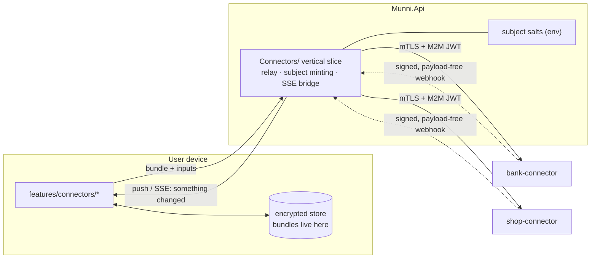

# munni integration — consumer specification

> **This is a specification handed to a separately managed project, not a
> change set.** munni lives in its own repository with its own lifecycle;
> `temp/munni (Copy)` in this repo is a read-only reference for
> architectural context and **is never edited**. Nothing here should be
> read as an instruction to modify that folder.
>
> What follows is the consumer side of the contract: what a client of
> these connectors has to implement, expressed against munni because
> munni is the intended first consumer. The munni team decides when and
> how to act on it. File paths are illustrative of munni's existing
> conventions, not a prescription.

Reads: [connector-platform-design.md](connector-platform-design.md) ·
[connector-api-spec.md](connector-api-spec.md) ·
[bank-connector-service.md](bank-connector-service.md) ·
[shopping-connector-service.md](shopping-connector-service.md)

---

## 1 · munni's role: a relay, and nothing more

The clients (PWA, native, web) never learn a connector hostname, never
hold a connector credential, never get a CORS grant. Every byte goes
through munni's API, which:

1. mints the **pseudonymous subject** for each user (per-service salt);
2. holds the **mTLS client cert and M2M credential** for each connector;
3. **relays** manifests, login calls, challenges and fetches;
4. **passes bundles through without storing them** — a bundle enters
   munni's memory and leaves in the same response;
5. owns **all user-facing copy** (nl/en/tr) keyed off the connectors'
   `message_key` / `label_key` values.



**The invariant to protect in code review:** no connector response body
containing a `bundle` or `inputs` may ever reach a `DbContext`. A single
integration test asserts this by scanning the relay's write paths.

---

## 2 · Server: a new vertical slice

Following munni's existing convention (`server/src/Munni.Api/<Area>/`):

```
server/src/Munni.Api/Connectors/
  ConnectorClient.cs          typed HttpClient — mTLS handler, M2M token cache, retry policy
  BankConnectorClient.cs      thin binding to the bank service
  ShopConnectorClient.cs      thin binding to the shop service
  ConnectorRelayEndpoints.cs  /connectors/{service}/* — the public surface
  ConnectorWebhookEndpoints.cs  /connectors/{service}/events — signature verify, dedupe, fan-out
  SubjectMinter.cs            HMAC(user_id, salt_per_service)
  ConnectorSse.cs             bridges a connector SSE stream to the client's channel
  ConnectorOptions.cs         base urls, cert refs, salts, timeouts
```

### 2.1 Relay surface

```http
GET    /connectors/{service}/providers                     → catalogue (cached, ETag-revalidated)
POST   /connectors/{service}/{provider}/login              → 200 | 202 + challenge
GET    /connectors/{service}/{provider}/login/{sid}
GET    /connectors/{service}/{provider}/login/{sid}/events           (SSE)
GET    /connectors/{service}/{provider}/login/{sid}/challenges/{cid}/image
POST   /connectors/{service}/{provider}/login/{sid}/answer
POST   /connectors/{service}/{provider}/{resource}/fetch   { bundle, params } → data + new bundle
DELETE /connectors/{service}/{provider}/sessions/{sid}
GET    /connectors/{service}/agents                        → this user's BYO agents
POST   /connectors/{service}/agents/enrollment
DELETE /connectors/{service}/agents/{aid}
```

`{service}` is `bank` or `shop` and maps to a client; everything else is
pass-through with the subject substituted in. The relay is deliberately
dumb: it does not interpret manifests, normalise data, or make retry
decisions. Those live in the connector.

Two things the relay **does** own:

- **`resume` is hidden from clients.** The relay calls
  `POST /v1/{provider}/sessions/resume` itself, holds the ticket for the
  duration of the fetch, and never exposes it. Clients only ever send a
  bundle.
- **Rate limiting per user**, on top of the connector's per-provider
  limits, so one user cannot spend the shared egress budget.

### 2.2 Auth and the zero-network law

Every relay route is `.RequireAuthorization()`, exactly like the endpoints
it replaces. Additionally — and this is the part that must not be got
wrong — **demo and offline identities must never reach the relay.**

munni's law is enforced client-side at the single `apiFetch` choke point,
which throws for demo/offline. The relay adds the server-side half: a
demo/offline `sub` gets `403 demo_identity`. Belt and braces, because a
connector call is a real outbound network request with a real
side effect, and a forgotten code path here would silently break the
strongest privacy promise the app makes.

Demo users still get the full experience: munni's demo seed includes
connections against `mock-bank-simple` and `mock-store-simple`, rendered
entirely from local fixtures with no request leaving the device.

### 2.3 Configuration

New compose environment on the `api` service, following the existing
naming:

```yaml
Connectors__Bank__BaseUrl: http://bank-connector-api:8080
Connectors__Bank__SubjectSalt: ${CONNECTOR_BANK_SUBJECT_SALT}
Connectors__Bank__M2mAppId: ${CONNECTOR_BANK_M2M_APP_ID}
Connectors__Bank__M2mAppSecret: ${CONNECTOR_BANK_M2M_APP_SECRET}
Connectors__Bank__ClientCertPem: ${CONNECTOR_BANK_CLIENT_CERT_PEM}
Connectors__Bank__ClientKeyPem: ${CONNECTOR_BANK_CLIENT_KEY_PEM}
Connectors__Bank__WebhookSigningKey: ${CONNECTOR_BANK_WEBHOOK_KEY}
Connectors__Shop__…    # same six, different values
```

All seven per service go into `infra/secrets.manifest.json`: the two
salts and the webhook keys are `generated`, the M2M pair and the cert are
`module` (written back by bootstrap after the connector's IaC runs).
An absent connector config disables that relay cleanly — a stack can run
with the shop connector and without the bank one.

---

## 3 · Client: `features/connectors/`

### 3.1 What the consumer retires

Once a provider is served by a connector, the consumer's own integration
for it becomes dead weight and should go: the on-device store adapters,
the server-side pass-through proxy and its upstream allowlist, and every
store or bank hostname in the app. The point of the quarantine is
undermined if the clean app keeps a second route to the same provider.

Retiring the proxy is the concrete, checkable outcome of the first
shopping slice — not a cleanup task to schedule later.

**What does not move:** receipt↔transaction matching, the receipt UI, the
receipt entities, and the feed mechanics. The connectors emit shapes that
fit an existing matcher precisely so the interesting half of the feature
stays where it is and keeps its test coverage.

The per-connection sync orchestration — "one pass: ingest, then match
into each included space" — is **rewritten, not deleted**. Only its data
source changes, from direct provider calls to one relay fetch. The
consumer's existing test suite for that orchestration is the contract the
rewrite must satisfy, and it is worth running unchanged as the first
proof the cutover is correct.

> A caution, learned from the Jumbo correction in the
> [shopping plan](shopping-connector-service.md) §3.3: an existing
> integration's *behaviour* is worth preserving, but its *documented
> beliefs about a provider* are not evidence. Provider facts come from
> the reference implementations, verified fresh.

### 3.2 What is added

```
apps/web/src/features/connectors/
  ConnectorCatalogScreen.tsx   "Connect an account" — renders from the manifest
  ConnectFlowScreen.tsx        the login flow — steps, challenges, live progress
  ChallengeSheet.tsx           image / QR / code / approval / redirect renderers
  ConnectionsScreen.tsx        state per connection, last sync, reason when broken
  AgentsScreen.tsx             BYO agents: enroll, health, revoke
  manifestForm.ts              manifest → form fields → validated inputs (pure)
  bundles.ts                   persist/rotate/purge bundles in the encrypted store
  connectorSync.ts             one fetch pass → ingest → match
```

**`manifestForm.ts` is the load-bearing piece.** It turns a provider
manifest into a rendered form with validation, i18n and autofill hints,
so adding a provider to a connector requires **zero munni changes**. That
is the concrete payoff of the user's requirement that the connector's API
declare its own interface — and it is worth a dedicated unit test suite
covering every `flow` and every field `type`.

### 3.3 Bundle custody on the device

```ts
interface ConnectorConnectionRow {
  id: string;                  // instance id, consumer-side
  service: 'bank' | 'shop';
  provider: string;            // 'lidl' | 'ah' | 'ing' | …
  label?: string;
  /** sb_v1.… opaque ciphertext. Empty on web once the tab session ends. */
  bundle: string;
  bundleIssuedAt: string;
  /** persistent = survives restarts; ephemeral = web, re-auth each visit */
  custody: 'persistent' | 'ephemeral';
  status: 'ok' | 'needs_signin' | 'needs_reauth' | 'blocked' | 'disabled';
  lastSyncAt?: string;
  agentId?: string;            // BYO / T4 — makes custody persistent anywhere
}
```

`needs_signin` is distinct from `needs_reauth` on purpose: the first is
the normal state of a web connection between visits and is not a
failure, the second means the provider rejected the session and the user
must actually reconnect. Collapsing them would make every web session
look broken.

Rules:

- **Native:** bundles live only in the encrypted store (SQLCipher,
  passphrase in Keychain/Keystore) and survive restarts indefinitely.
- **Web/PWA:** bundles live in **memory or `sessionStorage` only**, never
  `localStorage` and never IndexedDB. The connection row persists with
  `custody: 'ephemeral'` and an empty `bundle`, so the UI can show the
  connection as real-but-needs-signin rather than broken. The user
  re-authenticates on each visit — see platform design §4.1.1.
- **Either device class with a BYO agent:** the bundle holds only
  `{agent_id, profile_id}` and is not a credential, so web gets a fully
  persistent connection. Worth surfacing in the UI as the answer to
  *"why do I have to sign in again?"*.
- **Rotate on every response.** Any fetch returning
  `session.rotated: true` replaces the stored bundle in the same
  transaction that ingests the data. A crash between the two loses at
  most one sync, never the connection.
- **Never synced as plaintext, never in a backup export, never logged.**
  The backup path must skip the `bundle` field explicitly.
- Disconnect purges the local row *after* the connector confirms the
  upstream logout, so a failed logout does not orphan a live session.

The device class is sent to the connector as `X-Device-Class: native |
web` on login, and the connector caps web bundle TTLs accordingly. A
client that lies about its class only shortens or lengthens its own
bundle's life — it cannot gain access it did not have.

---

## 4 · Data flow into munni's existing model

Nothing new. Connector output lands in the structures munni already has:

| Connector output | Where it goes |
| --- | --- |
| receipts (+ items) | the owner's **store feed space**, exactly as `sync.ts` does today — global ingest, then per-space matching |
| bank accounts | account rows, tier `linked`, provenance recorded as connector-sourced |
| bank transactions | the account's **feed space**, deterministic ids, same dedupe as GoCardless and CAMT.053 imports |

The deterministic-id trick munni already relies on does the heavy
lifting: a connector-sourced ING savings transaction and the same
transaction later arriving in a CAMT.053 upload merge cleanly, because
both derive their id from the same facts.

**Account tier question that needs a product answer:** connector-sourced
bank accounts are neither `linked` (open banking) nor `imported`
(statement upload) nor `manual`. The cleanest answer is a fourth
provenance value on the existing `linked` tier — the row already states
its tier *and* provenance, so `linked / connector` renders honestly
("connected via your own agent", "syncs when you approve in the ING app")
without a schema change. Confirm before B2.

---

## 5 · What happens to the E2EE store-connection sync

munni has a designed and partly-shipped protocol (`CSK` + device
enrollment + fingerprint comparison) so store logins sync across a user's
devices without the server reading them. The connectors do **not** make it
obsolete — they make it better:

- Today it encrypts **raw store tokens**. After S1 it encrypts
  **sealed bundles**, which are already ciphertext the connector alone can
  open. The CSK layer becomes defence in depth over an opaque blob rather
  than the only thing standing between the server and a live token.
- The device-enrollment handshake, the fingerprint comparison and the
  `/me/store-sync/*` endpoints are unchanged. Only the plaintext being
  wrapped changes.
- The same mechanism now extends to **bank** connections for free, which
  was never in scope for the store-only design.

So: keep it, rename the concept from "store connection sync" to
"connection sync", and widen the blob type. This is a smaller change than
the earlier proposal (which suggested retiring the design entirely in
favour of server-held connections) and it preserves munni's strongest
privacy claim.

The alternative — server-held connections, account-scoped, "connect once
works everywhere" — remains available per provider via `secret_custody:
server`, and should be sold honestly if ever enabled: *"your login is
stored, encrypted, by our connection service"*, not *"never leaves your
device"*.

---

## 6 · Notifications and live progress

An interactive bank login runs for 60–120 seconds and stops to ask
questions. The client needs to see that.

- **App open:** the relay bridges the connector's SSE stream to the
  client over munni's existing `/sync/events` channel, as a new event
  kind. No new transport, no second EventSource, no CORS.
- **App closed during a scheduled sync:** the connector's
  `session.input_required` webhook triggers a **web push** through the
  existing `PushNotifier` — *"munni needs your approval to finish syncing
  ING"*. The push carries facts, not content decisions, and the service
  worker localises it, exactly as munni's pushes already work.
- **Local progress rendering** comes from the typed `step` enum, so the
  copy is munni's and translates properly. Never render a connector's
  raw string.

---

## 7 · Migration for existing users

A consumer with existing direct integrations holds raw provider tokens on
its users' devices. Two migration paths, and which applies depends on the
provider:

**Silent migration — where a durable refresh token exists.** Albert Heijn
qualifies: the device already holds a refresh token that the connector
can adopt. The adapter accepts it as an `existing_refresh_token` input on
login, returns a bundle, and the user notices nothing. The raw token is
deleted from the device once the bundle is written.

**Reconnect — everywhere else.** Where the existing credential is a
short-lived session (Jumbo's ~24h cookies) or where its provenance cannot
be trusted, the honest move is to mark the connection `needs_reauth` and
have the user connect once through the new flow. A one-time reconnection
is a small cost; silently carrying a credential of unverified shape into
a new system is not.

Sequence either way:

1. The new client ships alongside the existing integration for one
   release. Both read the same connection rows.
2. On first launch, each connection takes the silent path if its provider
   supports it, otherwise it is flagged for reconnection.
3. Raw tokens are deleted from the device as soon as a bundle exists.
4. The old adapters and the pass-through proxy are removed in the
   **following** release, once telemetry shows migration completed.

The `existing_refresh_token` input is a contained special case that
exists only for this migration and is removed with it — it must never
become a general-purpose way to inject credentials into a session.

---

## 8 · Sequencing against the connector slices

| Consumer work | Lands with | Notes |
| --- | --- | --- |
| Relay slice, subject minting, mTLS client, M2M tokens | S0 / B0 | against the mock providers only |
| Connector UI shell, manifest-driven forms, catalogue screen | S0 | rendered entirely from mock manifests |
| **AH cutover**, silent migration, pass-through proxy deleted | S1 | the slice that pays for the project |
| Ephemeral (web) custody handling, `needs_signin` state | S1 | web users arrive with the first real provider |
| **Lidl** connect, `mfa_code` challenge UI, `auth.config` selects, live progress | S2 | first real challenge relay, and the first config fields |
| **Jumbo** connect, honest 24h session messaging, reconnect migration | S3 | the UI must explain a daily sign-in without sounding broken |
| Bank connection UI, account provenance, feed ingest | B1 / B2 | reuses the existing feed mechanics |
| Agents screen, enrollment, health, revoke-and-wipe | B3 | unlocks always-on for **both** Jumbo and ASN |
| Scheduled sync + push for `input_required` | S6 / B5 | needs `unattended` providers to exist |

---

## 9 · Decisions this plan needs from the user

1. **How prominently is the BYO agent offered to web users?** Web custody
   is settled — ephemeral, re-auth per visit — but a BYO agent turns that
   into a persistent connection, and web users are the ones who benefit
   most. Whether that is a power-user setting or a first-class prompt in
   the connect flow is a product call. Needed before B3.
2. **Account provenance value** for connector-sourced bank accounts (§4)
   — a fourth provenance on the `linked` tier is the low-friction answer.
   Needed before B2.
3. **Connection sync scope** (§5) — confirm that the CSK design stays and
   simply wraps bundles instead of raw tokens. Needed before S1.
4. **Does munni proxy SSE, or does the client poll?** Proxying is better
   UX during a 90-second bank login and reuses the existing channel;
   polling is less code. Needed before K1/S2.
