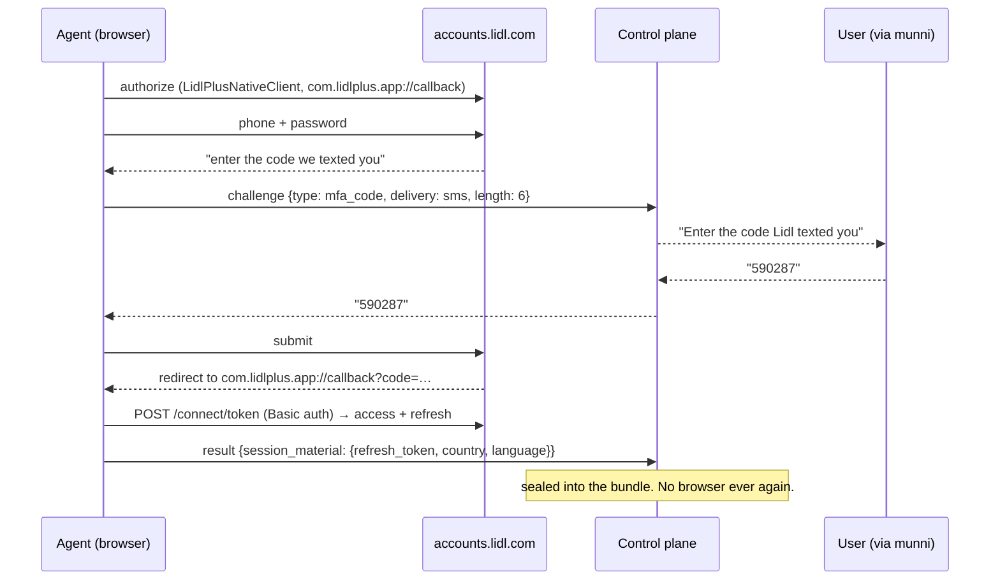

# Shopping Connector — service plan

Repo: `shop-connector` · Working service identity: **basketbridge**
(placeholder, see platform design §9) · Kind: `store`

Reads: [connector-platform-design.md](connector-platform-design.md) ·
[connector-api-spec.md](connector-api-spec.md)

> **Sourcing note.** Every provider profile below is derived from the
> public reference implementations named in §3, read directly. Nothing
> here is taken from munni's existing shopping code, which describes an
> older and partly incorrect picture of Jumbo in particular. Where a
> detail could not be confirmed from a reference, it is marked
> **`unconfirmed`** rather than guessed.
>
> **That rule was broken once, and it cost a live login (§3.2).** Albert
> Heijn's client id was correctly marked `unconfirmed` here, and the
> adapter shipped a plausible default for it anyway. `unconfirmed` in this
> document means *do not ship a value*, not *pick something sensible*.

---

## 1 · Scope

Retail receipts and their line items, from merchants with no public API.
What munni does with them — matching a receipt to a transaction it
already has — stays in munni. This service's job is to deliver receipts
in a normalised shape, and nothing else.

| In scope | Out of scope |
| --- | --- |
| Receipts / tickets and their line items | Placing or modifying orders |
| Order history where it is the only receipt source | Baskets, checkout, delivery slots |
| Store name, timestamp, total, payment tail, discounts | Loyalty redemption, coupon activation |
| The authenticated user's own history | Product catalogue, search, promotions |

**A note on restraint.** Every reference implementation below can do far
more than read receipts — baskets, orders, coupons, checkout. The
adapters implement the read paths only. This is partly discipline about
scope and partly risk: appie-go documents that Albert Heijn keeps a
server-side "active order" whose state can be left inconsistent by a
client that touches order endpoints and does not clean up. A connector
that only reads cannot corrupt a user's account.

---

## 2 · Why this is a different service from the bank one

Same protocol, genuinely different operational reality:

- **Bot protection is the adversary, not fraud detection.** All three
  providers below require a *real browser* for login precisely because
  their login pages are defended. The engineering problem is egress,
  pacing and browser realism — not SCA.
- **Volume is higher, value per call lower.** A receipt fetch is dozens
  of small calls; a bank fetch is one browser session.
- **Failure is cheap.** A blocked retailer is an annoyance; a locked bank
  account is an incident.
- **Providers churn without notice.** Adapter maintenance is the ongoing
  cost of this service specifically, which is why fixtures and canaries
  (API spec §6.2) matter more here than anywhere else.

---

## 3 · Provider profiles

Sources, read for this document:

| Provider | Reference | What it establishes |
| --- | --- | --- |
| Jumbo | [`DanielOostdam-Create/jumbo-cli`](https://pkg.go.dev/github.com/DanielOostdam-Create/jumbo-cli) | cookie session from a browser login, GraphQL, no refresh |
| Lidl Plus | [`yagueto/lidl-plus`](https://github.com/yagueto/lidl-plus) | browser OAuth once → refresh token forever |
| Albert Heijn | [`gwillem/appie-go` v0.0.12](https://github.com/gwillem/appie-go/tree/v0.0.12) | browser OAuth once → refresh token forever |

### 3.1 Lidl Plus — the T2 flagship

This is the textbook case for the tier the platform is built around:
**a browser drives login exactly once; a refresh token serves every fetch
afterwards, headlessly, forever.** It ships first because it proves the
whole `browser_once` path end to end.

Confirmed from the reference:

| | |
| --- | --- |
| OAuth client id | `LidlPlusNativeClient` |
| Authorize | `https://accounts.lidl.com/connect/authorize` |
| Token | `https://accounts.lidl.com/connect/token` (HTTP Basic; client id + a hardcoded secret component) |
| Redirect URI | `com.lidlplus.app://callback` |
| Scopes | `openid profile offline_access lpprofile lpapis` — **`offline_access` is what yields the refresh token** |
| Credentials | **phone number** (not email) + password + an **SMS verification code** |
| Browser needed | yes, for the initial login only (Chromium / Chrome / Firefox / Edge) |
| Tickets list | `GET https://tickets.lidlplus.com/api/v2/{COUNTRY}/tickets?pageNumber={n}&onlyFavorite={bool}` |
| Ticket detail | `GET https://tickets.lidlplus.com/api/v3/{COUNTRY}/tickets/{ticketId}` |
| Headers | `Authorization: Bearer …` · `App-Version: 999.99.9` · `Operating-System: iOs` · `App: com.lidl.eci.lidl.plus` · `Accept-Language: {lang}` · `Country: {COUNTRY}` |

Note the list and detail endpoints sit on **different API versions**
(`v2` and `v3`) — a small thing that will bite an adapter that assumes
one base path.

```jsonc
{
  "id": "lidl", "name": "Lidl Plus", "kind": "store", "country": "NL",
  "runtime": "browser_once",                    // T2 — browser for login only
  "agent": { "required": true, "class": "pooled",
             "egress": { "country": "NL", "kind": "residential" } },
  "unattended": true,                            // refresh token works headlessly
  "secret_custody": "client",
  "auth": {
    "flow": "password_sms",
    "config": [                                  // not secrets, but required to call the API
      { "key": "country",  "type": "select", "options": ["NL","DE","AT","BE","FR","IT","ES"],
        "required": true, "label_key": "connect.lidl.country" },
      { "key": "language", "type": "select", "options": ["nl","de","en","fr","it","es"],
        "required": true, "label_key": "connect.lidl.language" }
    ],
    "steps": [ { "id": "credentials", "fields": [
        { "key": "phone",    "type": "phone",    "secret": false,
          "label_key": "connect.lidl.phone", "pattern": "^\\+[1-9][0-9]{6,14}$" },
        { "key": "password", "type": "password", "secret": true,
          "label_key": "connect.field.password" } ] } ],
    "challenges": ["mfa_code"],                  // the SMS code
    "session": { "artifact": "sealed_bundle", "ttl_seconds": 7776000,
                 "refreshable": true, "rotates_on_use": true },
    "reauth": { "cheap": true, "trigger_codes": ["session_expired"] }
  },
  "resources": [
    { "id": "receipts", "endpoint": "GET /v1/lidl/receipts",
      "params": [ { "key": "since", "type": "date", "required": true },
                  { "key": "until", "type": "date" },
                  { "key": "include", "type": "enum", "values": ["items"], "multi": true } ],
      "max_history_days": 730 }
  ],
  "limits": { "min_interval_seconds": 21600, "concurrency": 1 }
}
```

Two things this provider forces into the platform, both of which are
improvements:

1. **`auth.config`** — a new manifest section for values that are neither
   secrets nor challenges but are required to talk to the provider at
   all. Lidl needs country and language on every call. Without this
   section the alternative is a provider-specific hack in munni, which is
   exactly what the manifest exists to prevent. See API spec §1.5.
2. **`flow: password_sms`** — credentials followed by an out-of-band code.
   The SMS arrives on the user's phone while a browser sits waiting on the
   agent, which is precisely what the challenge relay is for:



### 3.2 Albert Heijn — the second T2

Same shape as Lidl, different mechanics.

> **Rewritten 2026-07-27.** This section previously offered two login
> shapes and recommended the one that needed no agent. That recommendation
> is withdrawn — see *The decision, and what overrode it* below. Everything
> in the table is now read directly from `appie-go` v0.0.12 rather than
> inferred, and the three lines that were previously **guessed** are marked
> **CONFIRMED 2026-07-27** because guessing them cost a live login.

| | |
| --- | --- |
| API base | `https://api.ah.nl` |
| Client id | **`appie-ios`** — **CONFIRMED 2026-07-27** (`defaultClientID`, client.go) |
| Client version | `9.28` |
| User-Agent | `Appie/9.28 (iPhone17,3; iPhone; CPU OS 26_1 like Mac OS X)` |
| Headers on **every** `api.ah.nl` call | `x-client-name: appie-ios` · `x-client-version: 9.28` · `x-application: AHWEBSHOP` · `Accept: application/json` · `Content-Type: application/json` · the User-Agent above · `Authorization: Bearer …` when a token exists — **CONFIRMED 2026-07-27** (`setHeaders`, client.go) |
| Authorize | `https://login.ah.nl/login?client_id={id}&response_type=code&redirect_uri=appie://login-exit` |
| Redirect URI | `appie://login-exit` |
| Token exchange | `POST /mobile-auth/v1/auth/token`, body `{ clientId, code }` |
| Refresh | `POST /mobile-auth/v1/auth/token/refresh`, body `{ clientId, refreshToken }` |
| Anonymous access | `POST /mobile-auth/v1/auth/token/anonymous` for catalogue browsing — not needed here |
| Receipts | **GraphQL, `POST /graphql`** — **CONFIRMED 2026-07-27**. Not REST, and not under `/mobile-services/…` |
| Refresh behaviour | expired access tokens refresh automatically from the stored refresh token |

#### The three corrections, and why they are called out

All three were previously guessed or left `unconfirmed`, all three were
wrong, and all three are live-failure shaped rather than compile-failure
shaped:

1. **Client id is `appie-ios`, not `appie`.** This is the one that actually
   broke the first live attempt. It is worth being precise about *how* it
   broke, because the symptom names the wrong culprit: a wrong client id
   passes the login page — the human signs in successfully and sees nothing
   unusual — and then fails at the **token exchange**, which surfaces as
   `session_expired` or `invalid_credentials`. The obvious reading is "my
   password is wrong", which sends a user to reset a password that was fine.
   The plan's own instruction ("read it from the source, do not assume a
   value from elsewhere") was correct and was not followed; a plausible
   default shipped instead. **A default that looks reasonable is worse than
   an empty one that refuses to start.**
2. **The `x-client-*` / `x-application` header block is mandatory.** The
   adapter was sending none of them. As with Lidl's `App:` header, these are
   sent because the API needs them to route — not to disguise anything
   (§4.1).
3. **Receipts are GraphQL at `POST /graphql`.** The REST path the adapter
   used does not exist. And GraphQL errors arrive as a top-level `errors`
   array **with HTTP 200**, so a client that checks only the status code
   silently returns "you have no receipts" instead of failing — which is the
   worst possible outcome for a receipts connector, because it is
   indistinguishable from an empty account.

The two operations, verbatim (`POST /graphql`, body `{ query, variables }`,
no `operationName`):

```graphql
query FetchPosReceipts($offset: Int!, $limit: Int!) {
  posReceiptsPage(pagination: {offset: $offset, limit: $limit}) {
    posReceipts { id dateTime totalAmount { amount } }
  }
}

query FetchReceipt($id: String!) {
  posReceiptDetails(id: $id) {
    id
    memberId
    products  { id quantity name price { amount } amount { amount } }
    discounts { name amount { amount } }
    payments  { method amount { amount } }
  }
}
```

#### The decision, and what overrode it

This section used to lay out two login shapes — (a) a `redirect` challenge
where the user logs in on AH's own page and hands back the `appie://` URL
their browser cannot open, and (b) an agent-driven browser login — and
recommended (a), on the grounds that never handling an AH password is worth
an unusual paste step.

**(a) is withdrawn. AH is (b): browser-driven password login, T2,
`browser_once`, agent required.**

The argument for (a) was sound and reality did not care. The paste step
assumed an address bar to copy from and a redirect that visibly fails. On a
phone, `appie://login-exit?code=…` either opens the real Appie app — which
consumes the code — or fails with nothing to select, so there is frequently
nothing to paste. `appie-go`'s own `login.go` is the tell: rather than ask a
human to handle that URL, it **runs a local reverse proxy and rewrites every
`appie://login-exit` occurrence — in response bodies and in `Location`
headers alike — to `http://127.0.0.1:<port>/callback`**, so the browser
performs an ordinary HTTP redirect it can actually follow, and the handler
reads `?code=` off it. The reference implementation reached the same
conclusion we did, one step earlier.

What this costs, stated rather than glossed:

- **We now handle an AH password.** It fills a login form in the agent's
  browser and is never sealed into the bundle — only the refresh token is —
  but "AH is the provider whose password we never see" is no longer true.
- **AH is no longer the no-agent provider.** `ManifestValidator` enforces
  this rather than merely documenting it: any runtime other than `http`
  requires an agent, and the inline runner accepts only providers declaring
  `agent.class: inline, required: false`. So **every** AH job is leased to
  the agent, fetches included — not only login.
- **S1 no longer proves "a connector end to end with no browser".** It
  proves the same `browser_once` path Lidl does. Nothing in the platform
  changes; what changed is that the tier ladder has no real T1 provider on
  it, only mocks (§5).

What it buys: AH looks like every other provider in the consuming app —
username, password, connect — which is worth more than an elegant flow the
user cannot complete.

```jsonc
{
  "id": "ah", "name": "Albert Heijn", "kind": "store", "country": "NL",
  "runtime": "browser_once",                     // T2 — browser for login only
  "agent": { "required": true, "class": "pooled",
             "egress": { "country": "NL", "kind": "residential" } },
  "unattended": true,                            // the refresh token works headlessly
  "secret_custody": "client",
  "auth": {
    "flow": "password",
    "steps": [ { "id": "credentials", "fields": [
        { "key": "username", "type": "text",     "secret": false, "label_key": "connect.field.email" },
        { "key": "password", "type": "password", "secret": true,  "label_key": "connect.field.password" } ] } ],
    // image        a plain captcha: photographed, relayed, typed back
    // app_approval hCaptcha: interactive, so nothing can be relayed - an
    //              attended agent asks the human to pass it in the window it
    //              opened and waits; an unattended one answers
    //              blocked_by_provider at once rather than hanging
    // redirect     the last resort: finish on AH's own page, hand back the url
    "challenges": ["image", "app_approval", "redirect"],
    "session": { "artifact": "sealed_bundle", "ttl_seconds": 7776000,
                 "refreshable": true, "rotates_on_use": true },
    "reauth": { "cheap": true, "trigger_codes": ["session_expired"] }
  },
  "resources": [
    { "id": "receipts", "endpoint": "GET /v1/ah/receipts",
      "params": [ { "key": "since", "type": "date", "required": true },
                  { "key": "until", "type": "date" },
                  { "key": "include", "type": "enum", "values": ["items"], "multi": true } ] }
  ]
}
```

Still **`unconfirmed`**: which selectors identify the widget when it fires,
and the money units on each of the two GraphQL shapes. Both are declared
defensively rather than assumed away — the selectors because a CAPTCHA that
has nowhere to go is a dead session, the units because §4.2's reconciliation
catches an inconsistent pair but not a consistently wrong one.

That AH raises an hCaptcha is **confirmed**: a live attempt met one. It is an
interactive widget, not a picture — it wants drags and tile clicks and mints
its token in its own JavaScript — so it is never relayed and never solved.
Attended, the human passes it in the window the agent already has open and
the redirect is what tells us they did. Unattended, there is nobody at that
browser and the honest answer is `blocked_by_provider`, immediately.

### 3.3 Jumbo — **not** what we assumed

**This profile is a correction.** The working assumption was: a one-time
browser login yields a token, then mobile API endpoints with a refresh
token keep it alive. The reference does not support that.

What `jumbo-cli` actually establishes:

| | |
| --- | --- |
| Auth mechanism | **browser session cookies** — the user logs into jumbo.com in a real browser and the cookies *are* the credential |
| Token / refresh | **none.** No bearer token, no refresh grant, nothing to exchange |
| Session lifetime | **~24 hours**, then re-login |
| API | **GraphQL**, `https://www.jumbo.com/api/graphql` (Apollo Router, federated) |
| Introspection | **disabled** |
| Headers | `apollographql-client-name: JUMBO_MOBILE-orders` · `apollographql-client-version: 30.14.0` · `x-source: JUMBO_MOBILE-orders` · `jmb-device-id: {device-id}` |
| Receipts operation | `GetOnlineOrdersAndStoreReceipts` (online orders **and** in-store receipts) |
| Orders operation | `OrdersPageOrders` |

**Consequences, and they are significant:**

- **Jumbo is not T2.** With a 24-hour cookie and no refresh path, a
  `browser_once` login buys one day. The honest tiers are
  `browser_interactive` (T3) — a browser login whenever the cookie is
  stale — or `browser_persistent` (T4) on a BYO agent, where ordinary
  session renewal inside a long-lived profile keeps it alive.
- **Jumbo becomes the second flagship BYO-agent case, alongside ASN.**
  This is the strongest argument yet for building the agent protocol
  early rather than treating it as a late slice.
- **`jmb-device-id` must be stable per connection.** A device id that
  changes every run is a fraud signal. Generate one at connect time and
  seal it into the bundle alongside the cookies.
- **Introspection is disabled and Apollo Router is in front**, so the
  operation documents must be captured from the app's traffic, and
  automatic persisted queries (APQ) may be in play — a hashed-document
  protocol that a naive GraphQL client will fail against. **This is a
  discovery task that must complete before S3 is estimated**, not an
  implementation detail.

```jsonc
// 3.3a — pooled, interactive: the default
{
  "id": "jumbo", "name": "Jumbo", "kind": "store", "country": "NL",
  "runtime": "browser_interactive",             // T3 — a browser login when the cookie is stale
  "agent": { "required": true, "class": "pooled",
             "egress": { "country": "NL", "kind": "residential" } },
  "unattended": false,                           // a human logs in roughly daily
  "secret_custody": "client",
  "auth": {
    "flow": "password",
    "steps": [ { "id": "credentials", "fields": [
        { "key": "username", "type": "text",     "secret": false, "label_key": "connect.field.email" },
        { "key": "password", "type": "password", "secret": true,  "label_key": "connect.field.password" } ] } ],
    "challenges": ["image", "mfa_code"],         // unconfirmed which, if any, Jumbo raises
    "session": { "artifact": "sealed_bundle",
                 "ttl_seconds": 86400,            // the cookie's real life — be honest about it
                 "refreshable": false,
                 "rotates_on_use": true },
    "reauth": { "cheap": false, "trigger_codes": ["session_expired"] }
  },
  "resources": [
    { "id": "receipts", "endpoint": "GET /v1/jumbo/receipts",
      "params": [ { "key": "since", "type": "date", "required": true },
                  { "key": "until", "type": "date" },
                  { "key": "include", "type": "enum", "values": ["items"], "multi": true } ],
      "typical_duration_seconds": 40 }
  ],
  "limits": { "min_interval_seconds": 21600, "concurrency": 1 }
}

// 3.3b — BYO agent, persistent: the good experience
{
  "id": "jumbo-persistent", "name": "Jumbo (always-on)",
  "runtime": "browser_persistent",              // T4
  "agent": { "required": true, "class": "byo" },
  "unattended": true,
  "secret_custody": "agent",                     // the connector holds nothing
  "auth": { "flow": "device_persistent",
            "session": { "artifact": "sealed_bundle", "ttl_seconds": 31536000, "refreshable": true } }
  // resources identical to 3.3a
}
```

The `ttl_seconds: 86400` is deliberate and worth defending: a manifest
that claimed 30 days would make munni promise a month of silent syncing
and then fail. Declaring the real 24 hours lets munni say *"Jumbo asks
you to sign in about once a day — or set up an always-on agent"*, which
is honest and gives the user a real choice.

### 3.4 `mock-store` — built first

Ships in S0, before any real provider, and exercises the full protocol
offline: `mock-store-simple` (T1 instant), `mock-store-sms` (mfa_code
relay), `mock-store-captcha` (image relay), `mock-store-slow` (SSE and
lease renewal), `mock-store-broken` (`provider_changed` alert path),
`mock-store-persistent` (BYO agent routing).

---

## 4 · Engineering notes

### 4.1 Egress is the whole game

All three providers require a real browser for login, which means their
login pages are defended. Everything else is downstream of getting that
right:

- The pooled browser agent runs on a **residential Dutch line**, never
  the NAS.
- **One login at a time per provider, globally.** Six simultaneous Jumbo
  logins from one residential IP look like exactly what they are.
- **Jittered schedules**, ±25% on `min_interval_seconds`. A fleet that
  all fires at 03:00 is a signature.
- **Honest client identity, nothing more.** The app headers each provider
  requires (`App: com.lidl.eci.lidl.plus`, `x-source: JUMBO_MOBILE-orders`)
  are sent because the API needs them to route, not to disguise anything.
  No canvas spoofing, no header randomisation, no residential proxy pools.
- **A `blocked_by_provider` from any session pauses that provider for
  everyone** for a cool-down. One user's block is information about the
  shared egress; hammering through it burns the IP for everybody.

### 4.2 Amount units are a per-provider question, every time

Every one of these APIs represents money differently, and some represent
it inconsistently across endpoints within the same provider. The kit
therefore provides no clever heuristic — a heuristic that guesses wrong
silently corrupts financial data. Instead:

- each adapter declares its unit explicitly per field
  (`cents` | `euros_decimal` | `euros_string`);
- the kit converts and **asserts the reconstruction**: line items plus
  discounts must sum to the stated total, within one cent;
- a receipt that fails reconciliation is emitted with
  `reconciled: false` and a warning rather than being silently dropped —
  munni can then decide whether to show it.

This replaces guesswork with a checkable invariant, which is the whole
difference between a scraper that quietly drifts and one that tells you.

### 4.3 Detail fetches are the expensive part

`include=items` means one detail call per receipt. Rules:

- fetch details only for receipts newer than `since` — never the whole
  history;
- memoize per receipt within a pass;
- cap a fetch at `max_receipts_per_fetch` (default 200) and return
  `complete: false` with a cursor, so a first connect on a heavy account
  paginates instead of running for ten minutes;
- space detail calls through the politeness limiter — this is the call
  pattern most likely to trip protection.

### 4.4 What a normalised receipt must carry

munni matches receipts to transactions on amount, date proximity and
payment tail. The exact matcher lives in munni and is defined there; this
service's obligation is to populate the facts it needs:

- `total.value` in integer cents, reconciled per §4.2;
- `purchased_at` with a **real UTC offset**, never a bare date — a
  near-midnight purchase otherwise matches the wrong day;
- `payment.iban_tail` / `payment.card_last4` wherever the provider
  exposes them — **AH's is now `unconfirmed` too**: the confirmed
  `posReceiptDetails` selection set (§3.2) asks for `payments { method
  amount { amount } }` and nothing more, so there is no tail in the
  response we know how to make. Whether the schema offers one is a
  discovery task; until it is answered, emit an explicit null and let
  munni's matcher know its match on AH is weaker;
- `items[]` with `quantity`, `unit_price`, `total` and **`discount`** —
  without the discount lines a receipt's items do not sum to its total.

The contract is enforced by fixtures shipped with the connector, and
munni's side is verified in munni's own repo against those fixtures.

### 4.5 Deduplication

`(session_id, external_id)` uniqueness plus `content_hash` handles
re-fetch overlap. When a `content_hash` matches an existing row under a
*different* `external_id`, emit both — the connector does not get to
silently drop data it merely suspects is a duplicate.

---

## 5 · Slices

Reordered from the first draft, because the corrected provider facts
change which one proves the most:

| | Slice | Delivers | Depends on |
| --- | --- | --- | --- |
| **S0** | Repo, `shop-connector-api` + `shop-connector-agent` images, IaC stacks, control plane on `mock-store-*`, mTLS + M2M wiring | the pipe exists; nothing user-visible | K0 |
| **S1** | **Albert Heijn** — T2 `browser_once`, password login in the agent's browser, refresh tokens | the first real provider, and the first proof of the `browser_once` path | S0, K1, the pooled agent |
| **S2** | **Lidl Plus** — T2, browser OAuth once + `mfa_code` SMS relay + refresh token; `auth.config` (country/language); the residential pooled agent | proves the flagship `browser_once` tier and the challenge relay | S1, K2 |
| **S3** | **Jumbo** — GraphQL/APQ discovery spike **first**, then T3 with an honest 24h session and stable `jmb-device-id` | the hard provider, with its real constraints exposed rather than papered over | S2 |
| **S4** | Normalisation + reconciliation invariant, delta cursors + ack, fixture contract | receipts land in munni's matcher correctly and verifiably | S2 |
| **S5** | **Jumbo persistent** (T4) on a BYO agent | turns Jumbo from daily-login into always-on | S3, and the bank service's agent work |
| **S6** | Scheduled refresh for `unattended` providers (AH, Lidl), provider health, canaries, block cool-down | connections stop rotting silently | S4 |
| **S7** | Failure artifacts, operator console, per-provider metrics | the fleet stays maintainable | S3 |

**S1 is the slice that proves the architecture** — a full connector end to
end, though no longer without a browser: §3.2's correction moved AH to T2,
which means the pooled agent is now a dependency of the *first* slice rather
than the second. That is a real cost of the correction and it is stated here
rather than absorbed quietly. **S3 is where the difficulty actually lives**,
and it is deliberately third so that the platform is already proven when the
hard provider arrives.

With AH on T2, **no real provider sits on T1 any more** — only the
`mock-store-*` fleet does. T1 is still a tier the platform supports and
tests; it just has no production tenant today.

---

## 6 · Open questions specific to this service

1. **Jumbo's GraphQL protocol (blocking S3).** Are the operations plain
   documents or automatic persisted queries? What are the actual
   `GetOnlineOrdersAndStoreReceipts` variables and response shape? This
   needs a capture session against a live account before S3 can be
   estimated at all.
2. **Does Jumbo raise a CAPTCHA on login?** The manifest lists `image` as
   a possible challenge defensively; whether it fires is unconfirmed.
3. ~~**AH client id**~~ — **answered 2026-07-27: `appie-ios`** (§3.2). It
   was left open here and a plausible-looking default (`appie`) shipped
   anyway, which is what broke the first live login. The lesson is kept in
   the list rather than deleted with the question: an open question with a
   convenient default is an open question that stops being read.
4. ~~**AH login shape (§3.2)**~~ — **answered 2026-07-27: agent-driven
   browser password login, T2.** The `redirect` challenge was recommended
   and withdrawn; the paste step is not completable on a phone.
5. **Receipt history depth on first connect** — 90 days, or everything
   the provider has? Lidl exposes up to two years. Affects S1's
   pagination and the first-connect experience.
6. **Is Picnic worth adding?** It was a candidate before Lidl became a
   confirmed target. Decide after S4, based on where the user shops.
